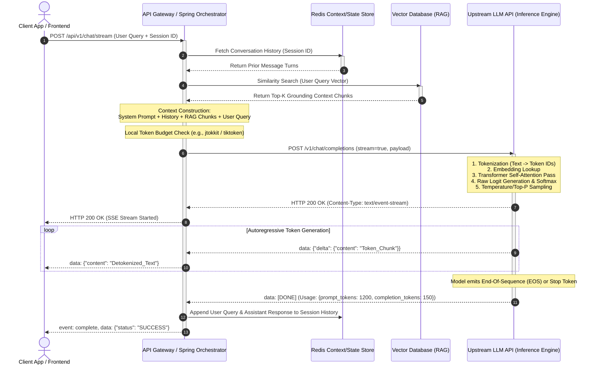

# 2. Prompt → Response Pipeline

## 1. Overview

### What It Is
The **Prompt → Response Pipeline** is the end-to-end execution path that transforms raw human text, software state, and external data into structured or natural language outputs produced by a Large Language Model (LLM). It spans the entire sequence of operations: assembling prompt payloads on the application backend, tokenizing text into discrete integer IDs, projecting tokens into high-dimensional vector embeddings, processing layers of multi-head self-attention and feed-forward networks, sampling probability distributions over vocabulary, detokenizing output tokens, and streaming the resulting text back to the client.

### Why It Exists
Generative AI models are not monolithic databases or procedural programs; they are high-dimensional statistical token predictors. They cannot directly process raw UTF-8 strings or arbitrary database records. The pipeline exists to bridge the gap between human language/software logic and the matrix mathematics of neural networks. It enforces structural context boundaries, converts text into mathematical vectors, manages non-deterministic sampling, and handles network protocol abstractions (such as Server-Sent Events) to deliver real-time outputs over standard web protocols.

### Why Software Engineers Should Care
Backend software engineers do not need to train or fine-tune neural networks to build enterprise AI applications, but they **must** master the prompt-to-response request lifecycle. In production systems:
- **Latency and User Experience:** The perception of application responsiveness depends on Time-to-First-Token (TTFT) and token generation throughput (tokens/sec). Unoptimized pipelines block network connections and cause HTTP timeouts.
- **Resource and Cost Management:** Enterprise LLM APIs charge based on input and output token volume. Poor pipeline construction leads to context window overflow, redundant token processing, and exponentially escalating API bills.
- **System Reliability:** LLM outputs are non-deterministic. Backend engineers must design resilient error-handling, rate-limiting, and schema validation layers around model inference to prevent system crashes and data corruption.

---

## 2. Core Concepts

### Request Lifecycle

```
+-----------------------------------------------------------------------------------+
|                                Context Construction                               |
|  +-------------------+   +-------------------+   +-----------------------------+  |
|  |   System Prompt   | + |   Chat History    | + | User Prompt + RAG Context   |  |
|  | (Behavior & Rules)|   | (Prior Turn State)|   | (Current Query & Grounding) |  |
|  +-------------------+   +-------------------+   +-----------------------------+  |
+-----------------------------------------------------------------------------------+
```

#### 1. User Prompt
- **Definition:** The dynamic, runtime text submitted directly by the client or end-user to initiate a task or query.
- **Intuition:** The user's explicit question or command (e.g., *"Summarize the attached quarterly earnings report"*).
- **Practical Explanation:** User prompts represent untrusted external input. In backend orchestrators, they must be validated, sanitized, and isolated within prompt delimiters (such as XML tags `<user_input>...</user_input>`) before being concatenated into the execution payload to mitigate prompt injection risks.
- **Common Misconception:** Believing the user prompt is the only text sent to the LLM API. In reality, the user prompt is often only a small fraction of the total token payload sent during inference.

#### 2. System Prompt
- **Definition:** High-priority system-level instructions placed at the beginning of the context window to define the model's persona, operational rules, safety boundaries, and output formatting.
- **Intuition:** The foundational "operating system parameters" provided by the developer that govern how the model must evaluate subsequent inputs.
- **Practical Explanation:** System prompts enforce business rules, such as `"You are a technical support agent for Acme Cloud. Respond strictly in JSON format. Do not answer questions outside of cloud infrastructure."` They remain relatively static across requests, making them ideal targets for provider-level prefix prompt caching.
- **Common Misconception:** Assuming the system prompt is completely immutable or inviolable. Adversarial user inputs can bypass weak system instructions if proper guardrails and delimiters are not enforced.

#### 3. Chat History
- **Definition:** The sequence of prior user queries and model responses stored from previous turns in a multi-turn conversation session.
- **Intuition:** The conversation transcript that gives the model "short-term memory" across separate API calls.
- **Practical Explanation:** Because LLM APIs are stateless HTTP endpoints, the backend application must re-transmit the entire conversation history on every new turn. As conversation history grows, backend systems must implement context window pruning (e.g., sliding window or background summarization) to prevent hitting context limits and exceeding token budgets.
- **Common Misconception:** Believing the model natively "remembers" past interactions on its servers. Every request is completely stateless; memory is entirely simulated by re-sending historical messages.

#### 4. Context Construction
- **Definition:** The backend orchestration process of gathering, formatting, and stitching together system instructions, conversation state, retrieved RAG documents, and user inputs into a unified JSON request structure.
- **Intuition:** The backend assembly line that builds the complete prompt payload before sending it over the network to the model provider.
- **Practical Explanation:** Context construction requires precise token budgeting. A backend orchestrator calculates token counts for system prompts, history, and RAG context using local tokenizer libraries (e.g., `jtokkit` for Java or `tiktoken` for Python) to ensure the total payload fits safely within the target model's context window.
- **Common Misconception:** Thinking context construction is simple string concatenation. In enterprise architecture, it involves database lookups, vector search retrieval, schema enforcement, and template rendering.

---

### Model Processing

```
+---------------------------------------------------------------------------------------+
|                                    Model Processing                                   |
|  Raw Text -> [Tokenization] -> Integer IDs -> [Embedding Lookup] -> High-D Vectors   |
|            -> [Transformer Attention/FFN] -> Raw Logits -> [Softmax & Sampling]       |
|            -> Selected Token ID -> [Detokenization] -> Character Output               |
+---------------------------------------------------------------------------------------+
```

#### 5. Tokenization
- **Definition:** The process of breaking down a raw UTF-8 string sequence into discrete, statistically meaningful subword units (tokens) and mapping them to numerical integer IDs using a fixed vocabulary index.
- **Intuition:** Translating human characters into the specific numeric "alphabet" understood by the neural network.
- **Practical Explanation:** Algorithms like Byte-Pair Encoding (BPE) or SentencePiece split common words into single tokens (e.g., `"java"` -> `[24254]`), while rare words, code syntax, or non-Latin scripts are split into multiple subword tokens. Tokenization directly determines context window usage and API billing.
- **Common Misconception:** Equating one token to one word or one character. In English text, 1 token averages roughly 4 characters or 0.75 words, whereas code and non-English text have significantly higher token densities.

#### 6. Context Window
- **Definition:** The maximum total number of tokens (input payload + generated output response) that an LLM can process in a single inference pass.
- **Intuition:** The hardware-bound working memory capacity of the language model during execution.
- **Practical Explanation:** If a request exceeds the context window (e.g., 128,000 tokens for GPT-4o), the provider API returns a `400 Bad Request` or silently truncates early tokens, dropping critical system instructions or conversation history. Engineers must enforce strict token budgeting before invocation.
- **Common Misconception:** Believing a larger context window (e.g., 1 Million tokens) eliminates the need for context management. Large context windows increase cost linearly, degrade Time-to-First-Token latency, and suffer from "lost-in-the-middle" accuracy degradation.

#### 7. Embedding Lookup
- **Definition:** The initial layer of the neural network that maps discrete integer token IDs into dense, high-dimensional vector representations (e.g., 4,096 dimensions) preserving semantic relationships.
- **Intuition:** Converting numeric token IDs into spatial coordinates where semantically similar tokens reside close to one another in vector space.
- **Practical Explanation:** While applications use external embedding models for RAG vector search, internal embedding lookup happens automatically within the LLM at the start of every inference pass.
- **Common Misconception:** Confusing internal token embedding lookup matrices with external vector database retrieval models (such as `text-embedding-3-small`).

#### 8. LLM Inference
- **Definition:** The computational pass of input vector representations through stacked Transformer architecture layers, where masked multi-head self-attention and feed-forward networks compute contextual token relationships.
- **Intuition:** The core mathematical process where tokens "attend" to prior tokens in the sequence to determine contextual meaning and calculate probabilities for what should come next.
- **Practical Explanation:** Self-attention scales quadratically $O(N^2)$ with input sequence length $N$ unless optimized with KV-caching. During inference, processing input tokens (prefill phase) is highly parallelizable on GPUs, whereas generating output tokens (decoding phase) is strictly sequential and memory-bandwidth bound.
- **Common Misconception:** Expecting inference speed to scale purely with CPU/GPU clock speed. Inference generation speed is primarily bottlenecked by GPU memory bandwidth rather than compute TFLOPS.

#### 9. Next Token Prediction
- **Definition:** The fundamental operating mechanism of autoregressive language models, wherein the model predicts the single most probable next token ID given the preceding sequence of tokens.
- **Intuition:** A sophisticated statistical completion engine running in a loop: `P(Token_N | Token_1, Token_2, ..., Token_N-1)`.
- **Practical Explanation:** An LLM does not generate full paragraphs in a single step. It predicts exactly one token at a time. That newly generated token is appended to the sequence, and the expanded sequence is fed back into the model to predict the subsequent token until a Stop Sequence or End-of-Sequence (`EOS`) token is emitted.
- **Common Misconception:** Assuming the model plans out its entire multi-paragraph reasoning before emitting text. Generation is entirely step-by-step and token-by-token.

#### 10. Sampling
- **Definition:** The algorithm that transforms unnormalized log probability scores (raw logits) emitted by the model's final layer into a probability distribution (via Softmax) and selects the next token ID.
- **Intuition:** The mechanism that determines how strictly the model picks the absolute top choice versus taking controlled probabilistic variations.
- **Practical Explanation:** Hyperparameters govern sampling:
  - **Temperature:** Scales raw logits before Softmax. Values near `0.0` make outputs deterministic by picking top logits; higher values (e.g., `0.8`) flatten the probability curve for creative variation.
  - **Top-P (Nucleus Sampling):** Restricts selection to the smallest set of tokens whose cumulative probability mass meets threshold $P$ (e.g., `0.90`), ignoring rare long-tail tokens.
- **Common Misconception:** Thinking `Temperature = 0.0` guarantees 100% deterministic output in distributed GPU production environments. Low-level floating-point non-determinism across parallel GPU workers can still yield minor variations.

#### 11. Detokenization
- **Definition:** The translation process of converting generated integer token IDs back into human-readable string characters and UTF-8 bytes.
- **Intuition:** Reassembling numeric subword codes back into human-readable text.
- **Practical Explanation:** Detokenization occurs continuously during streaming. Some tokens represent incomplete UTF-8 byte sequences (e.g., partial multi-byte Unicode characters for emojis or non-English scripts). The detokenizer must properly buffer partial bytes to avoid emitting corrupted characters to client streams.
- **Common Misconception:** Assuming every token ID maps cleanly to an entire English word. Single tokens can represent leading spaces, partial words, or individual punctuation marks.

---

### Response

#### 12. Streaming Responses (Server-Sent Events)
- **Definition:** An HTTP streaming architecture where the server pushes individual detokenized text chunks to the client in real-time as they are generated by the model, utilizing the `text/event-stream` media type.
- **Intuition:** Showing the user the answer as it is being typed in real-time rather than waiting for the entire multi-paragraph response to complete.
- **Practical Explanation:** Standard blocking HTTP calls suffer from high latency and HTTP connection timeouts when generating long responses. Server-Sent Events (SSE) keep a single persistent HTTP connection open, streaming token deltas incrementally. This slashes perceived latency (TTFT) from seconds down to milliseconds.
- **Common Misconception:** Believing SSE requires WebSockets. SSE is a lightweight, unidirectional, text-based HTTP protocol running over standard HTTP/1.1 or HTTP/2, making it vastly simpler to scale through standard API gateways and firewalls.

#### 13. Final Output Generation
- **Definition:** The terminal step of the response lifecycle where token generation completes, final metadata is compiled, and the complete response payload is finalized.
- **Intuition:** Wrapping up the job, recording token counts, logging usage metrics, and terminating the connection.
- **Practical Explanation:** Generation terminates when the model outputs a designated Stop Token (e.g., `<|im_end|>`), hits a defined `max_tokens` limit, or matches a user-specified stop sequence. The final payload contains execution statistics (`prompt_tokens`, `completion_tokens`, `total_tokens`, `finish_reason`), which the backend records for billing and observability.
- **Common Misconception:** Assuming `finish_reason: "stop"` always means successful task completion. If `max_tokens` is set too low, `finish_reason` will read `"length"`, indicating the output was forcibly truncated mid-sentence.

---

## 3. Internal Workflow

The diagram below traces the internal processing, data flow, and request lifecycle from client submission through backend orchestration, model inference, and SSE response streaming:



### Pipeline Decision Process & State Flow:
1. **Request Ingestion:** The client issues an asynchronous HTTP POST carrying the query and session identifiers.
2. **State & Retrieval Assembly:** The backend orchestrator concurrently fetches past conversation turns from Redis and queries pgvector/Qdrant for semantic domain context.
3. **Payload Sanitization & Budgeting:** Instructions are assembled into strict role hierarchy (`system`, `user`, `assistant`). Local pre-tokenization verifies payload constraints.
4. **Stream Handshake:** An HTTP `text/event-stream` pipeline is initialized.
5. **Autoregressive Processing:** The upstream inference engine executes KV-cache lookup, self-attention, and sampling passes, pushing chunked token deltas over SSE.
6. **State Mutation & Teardown:** Upon receiving `[DONE]`, the orchestrator writes updated conversation history back to Redis, logs usage metrics, and cleanly closes HTTP connections.

---

## 4. Real-world Backend Perspective

### Where This Appears in Production Systems
In enterprise engineering, the Prompt → Response pipeline sits at the core of:
- **Transactional Customer Support Workflows:** Streaming interactive diagnostic steps to users while querying internal knowledge bases.
- **Code Generation & Developer Tooling:** Inline IDE completion backends requiring sub-100ms Time-to-First-Token (TTFT).
- **Enterprise Search & Agentic Automation:** Multi-step tool-calling engines where intermediate steps require strict JSON schema execution.

### Architectural Patterns

#### 1. Asynchronous Reactive SSE Gateway Pattern
To prevent thread starvation and connection exhaustion under high concurrency, backend applications use non-blocking reactive frameworks (such as Spring WebFlux / Project Reactor in Java or FastAPI/asyncio in Python). Blocking I/O threads on multi-second LLM calls will rapidly exhaust thread pools.

```
Client (EventSource / Fetch) <--- SSE Stream ---> Reactive API Gateway (Spring WebFlux) <--- HTTP Chunked Stream ---> LLM Provider
```

#### 2. Stateless Application Nodes with Distributed Context Stores
To allow horizontal scaling of application instances, session context is offloaded to low-latency key-value stores like Redis. Application nodes remain entirely stateless.

```
                  +-----------------------+
                  |  Redis Cluster        |
                  | (Session State Store) |
                  +-----------+-----------+
                              ^
                              | Session State (Sliding Window)
                              v
+------------------+     +----+---------------+     +--------------------+
|  Client Request  | --> | App Instance (Auto)| --> | Upstream LLM API   |
+------------------+     +--------------------+     +--------------------+
```

### Production Architectural Trade-Offs

| Optimization Strategy | Advantages | Disadvantages / Trade-Offs |
| :--- | :--- | :--- |
| **SSE Response Streaming** | Slashes perceived latency (TTFT); prevents client HTTP timeouts. | Complex error handling; harder to apply output validation guardrails mid-stream. |
| **Sliding Window History** | Caps token costs; prevents context window overflow. | Drops long-term conversation context beyond the window boundary. |
| **Summary Context Compression** | Preserves core intent over long sessions at low token volume. | Requires additional asynchronous LLM summary calls; introduces minor background cost. |
| **Prefix Prompt Caching** | Reduces input token costs by up to 90%; speeds up processing. | Requires strict deterministic ordering of system prompts and static context. |

---

### Enterprise Java / Spring Boot Implementation

The production-ready Spring Boot service below implements asynchronous SSE response streaming, non-blocking token forwarding, and robust error handling using `WebClient` and Project Reactor:

```java
package com.enterprise.ai.pipeline.service;

import com.fasterxml.jackson.annotation.JsonProperty;
import com.fasterxml.jackson.databind.ObjectMapper;
import org.slf4j.Logger;
import org.slf4j.LoggerFactory;
import org.springframework.beans.factory.annotation.Value;
import org.springframework.http.MediaType;
import org.springframework.http.codec.ServerSentEvent;
import org.springframework.stereotype.Service;
import org.springframework.web.reactive.function.client.WebClient;
import org.springframework.web.reactive.function.client.WebClientResponseException;
import reactor.core.publisher.Flux;
import reactor.util.retry.Retry;

import java.time.Duration;
import java.util.List;
import java.util.Map;

@Service
public class LlmPipelineService {

    private static final Logger log = LoggerFactory.getLogger(LlmPipelineService.class);
    private final WebClient webClient;
    private final ObjectMapper objectMapper;

    @Value("${llm.api.key}")
    private String apiKey;

    public LlmPipelineService(WebClient.Builder webClientBuilder, ObjectMapper objectMapper) {
        this.webClient = webClientBuilder
                .baseUrl("https://api.openai.com/v1")
                .build();
        this.objectMapper = objectMapper;
    }

    /**
     * Executes non-blocking SSE streaming request to LLM API.
     * Integrates context construction, exponential backoff retries, and token parsing.
     */
    public Flux<ServerSentEvent<String>> streamPromptResponse(String systemPrompt, String userQuery, List<Map<String, String>> history) {
        
        // 1. Construct Structured Message Payload
        List<Map<String, String>> messages = new java.util.ArrayList<>();
        messages.add(Map.of("role", "system", "content", systemPrompt));
        messages.addAll(history);
        messages.add(Map.of("role", "user", "content", userQuery));

        Map<String, Object> requestBody = Map.of(
                "model", "gpt-4o",
                "messages", messages,
                "temperature", 0.2,
                "stream", true
        );

        // 2. Dispatch Non-blocking Reactive HTTP Stream
        return webClient.post()
                .uri("/chat/completions")
                .header("Authorization", "Bearer " + apiKey)
                .contentType(MediaType.APPLICATION_JSON)
                .accept(MediaType.TEXT_EVENT_STREAM)
                .bodyValue(requestBody)
                .retrieve()
                .bodyToFlux(String.class)
                .filter(chunk -> !chunk.equals("[DONE]"))
                .map(this::extractTokenDelta)
                .filter(token -> !token.isEmpty())
                .map(token -> ServerSentEvent.<String>builder()
                        .data(token)
                        .event("message")
                        .build())
                .retryWhen(Retry.backoff(3, Duration.ofSeconds(1))
                        .filter(throwable -> throwable instanceof WebClientResponseException.TooManyRequests
                                || throwable instanceof java.io.IOException)
                        .doBeforeRetry(retrySignal -> log.warn("Upstream LLM rate limited or connection failed. Retrying attempt #{}", retrySignal.totalRetries() + 1)))
                .onErrorResume(e -> {
                    log.error("Fatal pipeline error during LLM generation: {}", e.getMessage(), e);
                    return Flux.just(ServerSentEvent.<String>builder()
                            .event("error")
                            .data("An error occurred while generating response. Please try again.")
                            .build());
                });
    }

    /**
     * Helper method to parse raw SSE data chunk into detokenized text delta.
     */
    private String extractTokenDelta(String jsonChunk) {
        try {
            LlmStreamChunk chunk = objectMapper.readValue(jsonChunk, LlmStreamChunk.class);
            if (chunk.choices() != null && !chunk.choices().isEmpty()) {
                LlmStreamDelta delta = chunk.choices().get(0).delta();
                if (delta != null && delta.content() != null) {
                    return delta.content();
                }
            }
        } catch (Exception e) {
            // Log debug for non-JSON lines or keep-alive pings
            log.trace("Skipping unparseable SSE chunk: {}", jsonChunk);
        }
        return "";
    }

    // DTO records for Jackson parsing
    private record LlmStreamChunk(List<LlmStreamChoice> choices) {}
    private record LlmStreamChoice(LlmStreamDelta delta, @JsonProperty("finish_reason") String finishReason) {}
    private record LlmStreamDelta(String content, String role) {}
}
```

---

## 5. Best Practices

### Operational Recommendations

| Category | Recommended Practice | Anti-Pattern to Avoid |
| :--- | :--- | :--- |
| **Protocol Selection** | Use SSE (`text/event-stream`) for interactive user-facing generation. | Blocking standard REST calls for long generation tasks (causes HTTP timeouts). |
| **Token Budgeting** | Pre-compute and enforce token limits locally using `jtokkit`/`tiktoken` before API dispatch. | Unbounded string concatenation leading to HTTP 400 Context Exceeded errors. |
| **Sampling Discipline** | Use low Temperature (`0.0` to `0.2`) for JSON extraction, RAG, and classification tasks. | High Temperature (`0.8+`) on structured output pipelines (causes schema parsing errors). |
| **Security & Safety** | Wrap untrusted user input within strict delimiters (e.g., `<user_query>`). | Raw concatenation of user input directly into system instructions (invites Prompt Injection). |
| **Prompt Caching** | Structure system prompts and tool definitions deterministically at the start of context payloads. | Injecting dynamic timestamps or unique request IDs at the top of system prompts (breaks cache). |

### Performance & Latency Considerations
- **Optimize Time-to-First-Token (TTFT):** Keep system prompts focused and concise. Large static prefixes should be cached using provider prompt caching capabilities.
- **Connection Pooling & HTTP Keep-Alives:** Reuse TCP/TLS connections to provider APIs (`WebClient` pool tuning) to eliminate connection handshake overhead on every request.
- **Backpressure Management:** Reactive streams must handle client-side disconnection cleanly. Cancel upstream LLM requests immediately if the client closes the SSE connection to save token consumption.

---

## 6. Common Mistakes

| Incorrect Understanding | Correct Understanding |
| :--- | :--- |
| **"Setting Temperature = 0.0 makes model outputs 100% strictly deterministic."** | Temperature 0.0 selects the highest logit, but GPU floating-point non-determinism and parallel execution across GPU clusters can still produce occasional token variations. |
| **"Memory is persisted on LLM provider servers across API calls."** | LLM APIs are completely stateless. The backend application must re-transmit the entire conversation history on every single turn. |
| **"1 Token equals 1 Word or 1 Character."** | 1 Token averages ~4 English characters or ~0.75 words. Code, special characters, and non-English scripts have much higher token-to-word ratios. |
| **"Server-Sent Events (SSE) requires a WebSocket protocol setup."** | SSE runs over standard HTTP/1.1 or HTTP/2 persistent connections, making it far simpler to route through standard API gateways. |
| **"System prompts cannot be overridden by user input."** | Without strict input isolation and prompt delimiters, adversarial user input can subvert system instructions via prompt injection attacks. |
| **"A larger context window means you should dump all raw documents into the prompt."** | Massive context payloads linearly increase API costs, degrade Time-to-First-Token latency, and suffer from "lost-in-the-middle" accuracy retrieval degradation. |
| **"The LLM plans its entire response structure before emitting the first character."** | Models operate autoregressively, predicting strictly one token at a time based on preceding sequence probabilities. |

---

## 7. Interview Questions

### Beginner Level
1. What is the fundamental difference between an input token and an output token in LLM API pricing and execution mechanics?
2. Why are standard blocking HTTP requests ill-suited for generating long responses from LLM APIs, and how does Server-Sent Events (SSE) resolve this?
3. What is the purpose of a System Prompt, and how does it differ from a User Prompt in context construction?
4. Explain how subword tokenization (such as Byte-Pair Encoding) handles rare or out-of-vocabulary words without failing.
5. What happens when the total token count of a request exceeds a model's Context Window?

### Intermediate Level
1. Walk through the autoregressive next-token prediction loop. What is the explicit role of the KV-cache during this process?
2. Compare and contrast `Temperature` vs `Top-P` sampling. How do they mathematically alter the logit-to-probability distribution during inference?
3. How does a backend application maintain multi-turn chat memory across stateless API calls without causing unbounded token budget growth?
4. Explain how Prompt Injection occurs during Context Construction and detail two architectural strategies to mitigate it.
5. What is Time-to-First-Token (TTFT), and what specific backend pipeline optimizations improve it?

### Senior Level (Scenario-based)
1. **System Design Scenario:** You are designing the backend architecture for an enterprise code-completion assistant serving 10,000 concurrent developers. Total latency must remain under 200ms TTFT. How would you design the context assembly, connection management, caching layers, and streaming transport?
2. **FinOps & Cost Optimization Scenario:** Your enterprise customer support chatbot bill increased 4x over two months due to growing conversation history and large RAG context injections. Detail a step-by-step engineering audit and remediation plan to cut token spend by 50% without degrading response quality.
3. **Resilience & Backpressure Scenario:** During peak traffic, your upstream LLM provider frequently returns HTTP `429 Too Many Requests`. How do you design a resilient, non-blocking reactive gateway using Spring WebFlux, circuit breakers, and rate-limited queueing to handle this gracefully?
4. **Security Scenario:** A malicious user bypasses system prompt instructions in your financial app, forcing the model to reveal internal API keys injected into the context. How do you re-architect the pipeline to isolate secrets and sanitize inputs?
5. **Observability Scenario:** Users complain that a production RAG application occasionally stops generating text mid-sentence without returning an error. How do you diagnose whether this is caused by SSE connection timeouts, `max_tokens` truncation, or upstream provider cancellation?

---

## 8. Quick Revision

### Key Takeaways
- **Stateless Pipeline:** LLM APIs do not retain session memory; the backend must construct and re-transmit context (system prompt, conversation history, RAG documents, user query) on every call.
- **Tokens Over Text:** Models process integer token IDs, not characters. Subword tokenization (BPE/SentencePiece) dictates context consumption, latency, and costs.
- **Autoregressive Generation:** Output generation occurs token-by-token. Input prefill is GPU-parallelizable, but output decoding is sequential and memory-bandwidth bound.
- **SSE for Low Latency:** Real-time token streaming via Server-Sent Events (`text/event-stream`) minimizes Time-to-First-Token (TTFT) and prevents HTTP connection timeouts.
- **Sampling Controls Randomness:** Temperature scales logits before Softmax; Top-P restricts selection to cumulative probability thresholds. Low values are required for deterministic/JSON tasks.
- **Strict Context Budgeting:** Pre-compute token lengths locally before API dispatch to avoid context overflow and unexpected token cost spikes.
- **Prompt Injection Defense:** Isolate untrusted user input using clear structural delimiters (e.g., `<user_input>`) and sanitize inputs during context assembly.

---

### Interview Summary
> *"The Prompt → Response Pipeline encompasses the complete lifecycle of an LLM request. It starts with backend **Context Construction**, where system rules, session history from Redis, and RAG context are assembled into a structured payload. The payload undergoes **Tokenization** (converting text to integer IDs via subword algorithms like BPE) and is transmitted to the model.*
> 
> *Inside the inference engine, token IDs undergo **Embedding Lookup** and pass through stacked Transformer layers. The model operates **autoregressively**, generating one token at a time by sampling from the Softmax probability distribution over the vocabulary (controlled by Temperature and Top-P).*
> 
> *To optimize user experience and avoid timeouts, responses are **detokenized** and returned asynchronously using **Server-Sent Events (SSE)**. Production backend engineering requires thread-safe reactive I/O (e.g., Spring WebFlux), local pre-tokenization for budget enforcement, prefix prompt caching, sliding-window memory management, and strict prompt injection defenses."*
