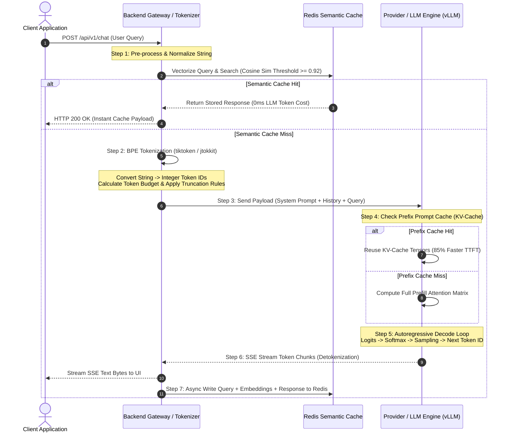

# Topic 3: Tokens & Context — Backend Engineering Handbook

---

## 1. Core Concepts

### Tokens & Tokenization

#### 1. What is a Token?
* **Definition**: A **token** is the fundamental atomic unit of text processed by a Large Language Model (LLM). Rather than operating directly on raw character strings or full natural language words, LLMs process sequences of integers (Token IDs) corresponding to variable-length subword character clusters within a fixed vocabulary [14, 35].
* **Intuition**: Think of tokens as the building blocks of an LLM's vocabulary—much like Morse code represents letters through combinations of dots and dashes. A token can represent a single character, a subword prefix, a common word (e.g., `"apple"`), or even whitespace and punctuation sequences [14, 214].
* **Practical Explanation**: When a backend service sends `"Hello, world!"` to an OpenAI or Claude endpoint, the client SDK or API gateway first runs a tokenizer function. For example, using OpenAI’s `cl100k_base` tokenizer, `"Hello, world!"` is converted into three token IDs: `[9906, 11, 1917]` (`"Hello"`, `","`, `" world"`). The model’s neural network only sees integer IDs and their corresponding dense embedding vectors [12, 14, 214].
* **Common Misconceptions**:
  * *Misconception*: One token always equals one word.
  * *Reality*: In English prose, 1 token averages roughly $0.75$ words (or $\sim 4$ characters) [14]. However, complex terminology, source code, and non-Latin scripts break into significantly more tokens per word [14, 334].

---

#### 2. Tokenization Mechanics & Subword Algorithms
* **Definition**: **Tokenization** is the deterministic pre-processing pipeline that segments raw UTF-8 strings into subword units based on a pre-trained static vocabulary index [4, 14, 35]. The dominant subword algorithms in production are **Byte-Pair Encoding (BPE)**, **WordPiece**, **SentencePiece**, and **Unigram** [15, 307].
* **Intuition**: If an LLM tried to maintain a vocabulary of every full word in every language, the vocabulary matrix would be infinitely large and fail on unseen words (Out-Of-Vocabulary / OOV) [150, 336]. If it operated purely on raw single characters, text sequences would be extremely long, crippling transformer attention performance [150, 385]. Subword tokenization strikes the optimal balance between sequence length and vocabulary size [150, 306].

```
Raw Text: "Unpredictability"
  │
  ├── Word-level Tokenizer   ──> ["Unpredictability"] (Fails if OOV)
  ├── Character-level        ──> ['U','n','p','r','e','d','i','c','t','a','b','i','l','i','t','y'] (Extremely long)
  └── Subword (BPE)          ──> ["Un", "predict", "ability"] (Optimal balance)
```

* **Algorithm Comparison**:

| Subword Algorithm | Training / Merge Metric | Key Mechanism | Best Use Case / Production Models |
| :--- | :--- | :--- | :--- |
| **Byte-Pair Encoding (BPE)** | Frequency-based merge metrics [15, 307]. | Iteratively merges the most frequent adjacent character/byte pairs in the corpus [15, 307]. | Modern general LLMs: GPT-4 (`cl100k_base`), GPT-4o (`o200k`), LLaMA 3 (`tiktoken`) [15, 307]. |
| **WordPiece** | Likelihood maximization under a language model [15, 307, 383]. | Merges pairs that maximize corpus likelihood over individual token probabilities [15, 383]. Uses `##` prefix for subword continuation [343]. | BERT, DistilBERT, and early Google transformer embedding models [15, 307, 343]. |
| **SentencePiece** | Unsupervised direct-on-raw-text processing (supports BPE or Unigram) [15, 307, 381]. | Treats raw whitespace as an explicit character (`_`), bypassing language-specific pre-tokenization rules [15, 381, 419]. | Multilingual models and non-whitespace languages (T5, Gemma, LLaMA 2, ALBERT) [15, 307, 344]. |
| **Unigram Language Model** | Entropy-based optimization (Minimum Description Length) [15, 130, 307]. | Starts with a massive overcomplete vocabulary and iteratively prunes subwords that minimize likelihood loss [15, 130, 307]. | Probabilistic subword sampling during pre-training; T5, mBART [15, 307]. |

* **Practical Explanation**: Modern models (such as LLaMA 3 and GPT-4o) employ **Byte-fallback BPE** [307, 310]. If the tokenizer encounters an obscure emoji or unseen Unicode character, it falls back to raw individual UTF-8 bytes [310]. This guarantees $100\%$ vocabulary coverage without ever throwing an `<UNK>` (Unknown) exception or dropping characters [310].
* **Common Misconceptions**:
  * *Misconception*: Changing or updating a model's tokenizer during fine-tuning is simple.
  * *Reality*: A model's weights and embedding matrices are hard-bound to its exact vocabulary token IDs [165, 308]. Swapping a tokenizer corrupts the entire embedding lookup table, rendering model weights useless [165, 308].

---

#### 3. Token Count vs. Character Count
* **Definition**: **Token density** (measured as characters per token, $\text{char/token}$) measures how efficiently a tokenizer compresses text into token IDs [133].
* **Intuition**: Human text length is naturally measured in characters or words, but LLM infrastructure costs, latency, and context limits are strictly denominated in tokens [14, 150]. A character-to-token ratio varies drastically across languages, source code, and structured data formats [14, 334].
* **Practical Explanation**:
  * **English Prose**: $\sim 4$ characters per token ($\sim 0.75$ words/token) [14, 334].
  * **Source Code (Java, Python, JS)**: $\sim 1.5$–$2.5$ characters per token due to indentation, brackets, camelCase variables (`customerBillingAddress` splits into `["customer", "Billing", "Address"]`), and syntax operators [334, 352].
  * **Structured JSON / YAML**: $\sim 1.5$–$2.0$ characters per token due to quotes, braces, colons, and formatting keys [334, 360].
  * **Non-Latin Languages (Arabic, Hindi, Korean, Cyrillic)**: $\sim 1.0$–$1.5$ characters per token (or $3$–$6$ tokens per word) because pre-training corpora were heavily English-skewed, causing non-Latin scripts to be split into tiny byte-level subwords [14, 312, 334, 351].

```
Text: "Hello World"          ──> Tokenizer ──> ["Hello", " World"]          (2 Tokens)
Code: "public static void"   ──> Tokenizer ──> ["public", " static", " void"] (3 Tokens)
Hindi: "नमस्ते दुनिया"          ──> Tokenizer ──> ["न", "मस", "्ते", ...]       (8+ Tokens)
```

* **Common Misconceptions**:
  * *Misconception*: A 1,000-word English document and a 1,000-word Hindi document consume the same context window budget and API cost.
  * *Reality*: The Hindi document can consume $3\times$ to $5\times$ more tokens than the English document, leading to unexpected API budget overruns and context truncation [134, 334, 351].

---

### Context & Memory Limits

```
┌──────────────────────────────────────────────────────────────────────────────────┐
│                             TOTAL CONTEXT WINDOW LIMIT                           │
│                                  (e.g., 128,000 Tokens)                          │
├──────────────────────────────────────────────────────────┬───────────────────────┤
│                     INPUT PROMPT                         │    MAX OUTPUT TOKENS  │
│  ┌──────────────┬──────────────┬──────────────────────┐  │   (e.g., 4,096 Tokens)│
│  │ System Rules │ Chat History │ Retracted Context    │  │  ┌─────────────────┐ │
│  │ (Prefix Cache│ (Sliding     │ (RAG Chunks / Tools) │  │  │ Generated Model │ │
│  │  Target)     │  Window)     │                      │  │  │ Tokens          │ │
│  └──────────────┴──────────────┴──────────────────────┘  │  └─────────────────┘ │
└──────────────────────────────────────────────────────────┴───────────────────────┘
```

#### 4. Context Window Architecture
* **Definition**: The **Context Window** is the fixed hardware and architecture-defined upper limit on the total number of tokens (Input Tokens + Output Tokens combined) that an LLM can process in a single inference execution pass [10, 16].
* **Intuition**: Think of the context window as the model's short-term Working Memory (RAM). Anything inside the context window is accessible via the self-attention mechanism; anything outside it is completely invisible to the model [12, 16].
* **Practical Explanation**: If a model has a $128,000$ token context limit (e.g., GPT-4o) and a maximum output token limit of $4,096$ tokens, the maximum allowable input prompt payload is $128,000 - 4,096 = 123,904$ tokens [16, 65].
* **Common Misconceptions**:
  * *Misconception*: A model with a 1,000,000 token context window can process 1M tokens of generated output.
  * *Reality*: Models enforce separate hard ceilings on **Maximum Output Tokens** (typically $4,096$ to $16,384$ tokens) regardless of total context window capacity [22, 65].

---

#### 5. Input Tokens vs. Output Tokens (Compute & Latency Asymmetry)
* **Definition**: 
  * **Input Tokens (Prompt Tokens)**: Tokens provided by the caller (System Prompt, User Query, Conversation History, RAG Context) [11, 181].
  * **Output Tokens (Completion Tokens)**: Tokens generated autoregressively by the model [13, 181].
* **Intuition**: Processing input tokens is like reading a textbook—it happens in parallel across GPU CUDA cores in a single forward matrix multiplication pass (**Prefill Phase**) [12, 181]. Generating output tokens is like writing a book word-by-word—it requires sequential, step-by-step passes where each generated token must be fed back into the model to predict the next token (**Decode Phase**) [13, 36].
* **Practical Explanation**:
  * **Latency**: Input token processing is fast ($\text{TTFT}$—Time To First Token), whereas output generation is memory-bandwidth bound and slow ($\text{TBT}$—Time Between Tokens, e.g., $30$–$80$ ms per output token) [13, 208, 281].
  * **Pricing**: Managed providers price Output Tokens $3\times$ to $4\times$ higher than Input Tokens because output generation holds GPU VRAM allocations locked for significantly longer durations during the autoregressive loop [181, 323].

---

#### 6. Context Truncation & "Lost in the Middle"
* **Definition**: **Context Truncation** occurs when an incoming prompt payload exceeds the maximum context limit, causing early tokens (such as system instructions or initial conversation turns) to be dropped [16]. The **"Lost in the Middle"** phenomenon (or context rot) refers to the performance degradation where LLMs attend strongly to tokens at the very beginning and very end of a long context window while failing to retrieve information buried in the middle [320].
* **Intuition**: If you read a 500-page document in one sitting, you easily recall the opening chapter and the conclusion, but struggle to recall specific details on page 245.
* **Practical Explanation**: Passing massive 100K+ token payloads directly into an LLM degrades reasoning accuracy and increases costs exponentially [320]. Backend architectures mitigate this using **Reranking models** (e.g., Cohere Rerank, BGE-Reranker) to trim 50 raw retrieved chunks down to the top 3–5 hyper-relevant chunks before injecting them into the prompt [321].

---

#### 7. Token Budgeting Strategies
* **Definition**: **Token Budgeting** is the algorithmic management of prompt allocations across system prompts, conversation history, dynamic context, and generation headrooms to guarantee payloads remain safely within provider limits [16, 65].
* **Intuition**: Like a financial budget, every component of an LLM request has a strict allowance. If conversation history consumes $80\%$ of the budget, there is no room left for RAG retrieval or model generation [16, 65].
* **Calculated Formula**:
  $$\text{Budget}_{\text{RAG Context}} = \text{Context}_{\text{Max}} - \text{Max Output} - \text{Tokens}_{\text{System}} - \text{Tokens}_{\text{History}} - \text{Tokens}_{\text{User Query}} - \text{Safety Buffer}$$
* **Common Strategies**:
  1. **Sliding Window Memory**: Drops oldest turns when history exceeds a token threshold [24, 358].
  2. **Summary Memory**: Background worker summarizes old interaction turns into a concise executive summary [24, 358].
  3. **Hierarchical Pruning**: Prioritizes System Prompts > User Query > Recent History > RAG Context [200].

---

### Cost & FinOps Optimization

```
┌─────────────────────────────────────────────────────────────────────────────────┐
│                           THREE-TIER CACHING ARCHITECTURE                       │
├─────────────────────────────────────────────────────────────────────────────────┤
│  Layer 1: SEMANTIC CACHE (Gateway / Redis Vector DB)                            │
│  └── Cosine Similarity >= 0.92  ──> Returns Full Response (0ms LLM, 100% Free)   │
│                                                                                 │
│  Layer 2: PREFIX PROMPT CACHE (LLM Provider / vLLM KV-Cache)                    │
│  └── Exact Byte-Prefix Match    ──> Bypasses Prefill (85% TTFT, 50-90% Discount)│
│                                                                                 │
│  Layer 3: FULL INFERENCE (GPU Cluster)                                          │
│  └── Autoregressive Compute     ──> Full Token Cost & Generation Latency        │
└─────────────────────────────────────────────────────────────────────────────────┘
```

#### 8. API Pricing & Prompt Caching Economics
* **Definition**: **Prompt Caching** (Prefix Caching) stores the pre-computed Key-Value (KV) attention tensors for static prompt prefixes directly within provider infrastructure or local GPU VRAM [17, 181].
* **Economics & Break-Even**:

| Provider / Engine | Cache Write Cost | Cache Read Cost | Minimum Token Threshold | TTL / Expiration Rules |
| :--- | :--- | :--- | :--- | :--- |
| **Anthropic Claude** | $+25\%$ premium over base input price [183]. | **$90\%$ discount** ($10\%$ of base input cost) [17, 183]. | $1,024$ tokens per checkpoint [183]. | $5$ minutes (refreshed on hit, up to 1 hr) [183]. |
| **OpenAI / Azure OpenAI** | $0\%$ premium (automatic) [180, 184]. | **$50\%$ discount** on cached tokens [180, 184]. | $1,024$ tokens [184, 319]. | Automatic LRU eviction ($\sim 5$–$10$ mins) [184, 241]. |
| **vLLM / SGLang (Self-Hosted)**| $0$ (GPU VRAM / RAM allocation) [185, 282].| **$100\%$ compute savings** on prefix attention pass [186, 282].| Block size dependent (e.g., $16$ tokens) [186, 282].| LRU / Radix Tree eviction [186, 282]. |

* **Break-Even Math (Anthropic Example)**:
  * Base Input Cost = $\$3.00 / \text{M tokens}$
  * Cache Write = $\$3.75 / \text{M tokens}$ ($1.25\times$)
  * Cache Read = $\$0.30 / \text{M tokens}$ ($0.10\times$)
  * $\text{Break-Even} = \frac{\$3.75 - \$3.00}{\$3.00 - \$0.30} = 1.39 \text{ reads}$
  * **Result**: If a static system prompt prefix is reused at least **2 times** within the 5-minute TTL window, prompt caching yields immediate net financial savings [193].

---

#### 9. Semantic Caching
* **Definition**: **Semantic Caching** intercepts user queries at the API gateway layer, vectorizes the query using a fast embedding model (e.g., `BGE-M3`), and performs a vector similarity search against previously stored query-response pairs [17, 281].
* **Operational Math**:
  $$\text{Similarity}(\mathbf{u}, \mathbf{v}) = \frac{\mathbf{u} \cdot \mathbf{v}}{\|\mathbf{u}\| \|\mathbf{v}\|} \ge \text{Threshold } (e.g., 0.92)$$
* **Yield**:
  * **Latency**: Drops response time from $1,000\text{ms}+$ down to $3$–$8\text{ms}$ [17, 281].
  * **Cost**: $100\%$ reduction in LLM API token costs on cache hits [17, 317].
* **Comparison Matrix**:

| Feature | Semantic Caching | Prompt Caching (Prefix) |
| :--- | :--- | :--- |
| **Matching Key** | High-dimensional Vector Cosine Similarity [17, 317]. | Exact, byte-perfect string prefix match starting at token 0 [17, 319]. |
| **Operational Layer** | Application API Gateway / Redis Vector Store [17, 289]. | LLM Provider Infrastructure / vLLM Engine [17, 185]. |
| **Execution Point** | Before reaching the LLM API [96, 289]. | Inside the LLM Attention Engine during prefill [181, 282]. |
| **Failure Risk** | "Semantic Flattening": serving a stale/incorrect response if threshold is set too low ($<0.90$) [17, 296]. | Cache Invalidation: changing a single character at token 0 invalidates the prefix [17, 319]. |

---

#### 10. Prompt Optimization & Context Management
* **System Prompt Compression**: Trim verbose conversational instructions into concise markdown bullet points [322, 357].
* **Structured Output Compactness**: Replace verbose JSON keys (`"customerBillingStreetAddress"`) with compact keys (`"addr"`) and strip pretty-printed spaces/newlines in API requests [322, 360].
* **Model Tiering & Routing**: Use lightweight, inexpensive models (e.g., `GPT-4o-mini`, `Claude 3.5 Haiku`) for classification and extraction tasks, routing only complex reasoning to tier-1 models (`GPT-4o`, `Claude 3.5 Sonnet`) [39, 360].

---

## 2. Request Lifecycle & Token Data Flow



---

## 3. Production Code Implementation (Spring Boot & Java)

Below is a production-grade Spring Boot service implementing token counting, exact token budgeting, cost estimation, prompt truncation, and prefix-cache optimization using the high-performance `jtokkit` library (Java BPE Tokenizer).

### `pom.xml` Dependency

```xml
<dependency>
    <groupId>com.knaddison</groupId>
    <artifactId>jtokkit</artifactId>
    <version>1.1.0</version>
</dependency>
```

### `TokenBudgetService.java`

```java
package com.enterprise.ai.service;

import com.knaddison.jtokkit.Encodings;
import com.knaddison.jtokkit.api.Encoding;
import com.knaddison.jtokkit.api.EncodingRegistry;
import com.knaddison.jtokkit.api.EncodingType;
import com.knaddison.jtokkit.api.IntArrayList;
import org.slf4j.Logger;
import org.slf4j.LoggerFactory;
import org.springframework.stereotype.Service;

import java.math.BigDecimal;
import java.math.RoundingMode;
import java.util.ArrayList;
import java.util.List;

@Service
public class TokenBudgetService {

    private static final Logger log = LoggerFactory.getLogger(TokenBudgetService.class);
    
    private final EncodingRegistry registry = Encodings.newDefaultEncodingRegistry();
    private final Encoding encoding = registry.getEncoding(EncodingType.CL100K_BASE);

    // Pricing Constants (GPT-4o per 1,000 tokens)
    private static final BigDecimal INPUT_COST_PER_1K = new BigDecimal("0.00250");
    private static final BigDecimal CACHED_INPUT_COST_PER_1K = new BigDecimal("0.00125");
    private static final BigDecimal OUTPUT_COST_PER_1K = new BigDecimal("0.01000");

    public record ChatMessage(String role, String content) {}

    public record TokenCostEstimate(
            int inputTokens,
            int outputTokens,
            boolean isCached,
            BigDecimal estimatedCostUsd
    ) {}

    /**
     * Accurately counts tokens in a raw string.
     */
    public int countTokens(String text) {
        if (text == null || text.isEmpty()) {
            return 0;
        }
        return encoding.countTokens(text);
    }

    /**
     * Counts tokens for structured chat messages, accounting for message framing overhead.
     */
    public int countChatMessageTokens(List<ChatMessage> messages) {
        int tokenCount = 0;
        for (ChatMessage message : messages) {
            tokenCount += 3; // Overhead per message (<|start|>{role}\n{content}<|end|>)
            tokenCount += countTokens(message.role());
            tokenCount += countTokens(message.content());
        }
        tokenCount += 3; // Assistant reply priming overhead
        return tokenCount;
    }

    /**
     * Enforces a strict Token Budget by truncating older chat history turns,
     * preserving System Prompt (Prefix Cache) and latest User Query.
     */
    public List<ChatMessage> enforceTokenBudget(
            String systemPrompt,
            List<ChatMessage> history,
            String userQuery,
            int maxContextTokens,
            int maxOutputTokens) {

        int systemTokens = countTokens(systemPrompt) + 4;
        int queryTokens = countTokens(userQuery) + 4;
        int safetyBuffer = 100;

        int availableHistoryBudget = maxContextTokens - maxOutputTokens - systemTokens - queryTokens - safetyBuffer;

        if (availableHistoryBudget < 0) {
            log.warn("System prompt + User query exceeds token budget! Truncating RAG / Context.");
            throw new IllegalArgumentException("Payload exceeds maximum allowable token budget.");
        }

        List<ChatMessage> trimmedHistory = new ArrayList<>();
        int currentHistoryTokens = 0;

        // Iterate backwards from most recent conversation turns
        for (int i = history.size() - 1; i >= 0; i--) {
            ChatMessage msg = history.get(i);
            int msgTokens = countTokens(msg.content()) + 4;

            if (currentHistoryTokens + msgTokens <= availableHistoryBudget) {
                trimmedHistory.add(0, msg); // Keep message
                currentHistoryTokens += msgTokens;
            } else {
                log.info("Token budget reached. Pruned older message from context at index {}", i);
                break; // Stop adding older messages
            }
        }

        List<ChatMessage> finalPayload = new ArrayList<>();
        finalPayload.add(new ChatMessage("system", systemPrompt));
        finalPayload.addAll(trimmedHistory);
        finalPayload.add(new ChatMessage("user", userQuery));

        log.info("Token Budget Enforced. Total Input Tokens: {}", countChatMessageTokens(finalPayload));
        return finalPayload;
    }

    /**
     * Calculates estimated financial cost for an API invocation.
     */
    public TokenCostEstimate calculateCost(int inputTokens, int outputTokens, boolean isPrefixCached) {
        BigDecimal inputRate = isPrefixCached ? CACHED_INPUT_COST_PER_1K : INPUT_COST_PER_1K;

        BigDecimal inputCost = BigDecimal.valueOf(inputTokens)
                .divide(BigDecimal.valueOf(1000), 6, RoundingMode.HALF_UP)
                .multiply(inputRate);

        BigDecimal outputCost = BigDecimal.valueOf(outputTokens)
                .divide(BigDecimal.valueOf(1000), 6, RoundingMode.HALF_UP)
                .multiply(OUTPUT_COST_PER_1K);

        BigDecimal totalCost = inputCost.add(outputCost).setScale(6, RoundingMode.HALF_UP);

        return new TokenCostEstimate(inputTokens, outputTokens, isPrefixCached, totalCost);
    }
}
```

---

## 4. Common Misconceptions vs. Engineering Reality

| Area | Misconception | Engineering Reality |
| :--- | :--- | :--- |
| **Token Ratio** | $1 \text{ Word} = 1 \text{ Token}$ across all text formats. | $1 \text{ Word} \approx 1.3 \text{ Tokens}$ in English, but code and JSON average $2$–$4 \text{ tokens/word}$, and non-Latin scripts (Hindi, Arabic, CJK) average $3$–$6 \text{ tokens/word}$ [14, 334]. |
| **Context Limit** | A $128\text{K}$ context window allows generating $128\text{K}$ tokens of output text. | Total context limits apply to Input + Output combined. Managed APIs enforce separate hard ceilings on output tokens (typically $4,096$ to $16,384$ max output tokens) [16, 65]. |
| **Prompt Caching** | Prompt Caching triggers regardless of where static text is located in a prompt. | Prompt Caching requires an **exact, byte-for-byte prefix match starting at token 0** [17, 319]. Dynamic timestamps or random request IDs placed at the top of a system prompt instantly invalidate the cache [17, 319]. |
| **Perplexity** | Perplexity score can be directly compared across two models using different tokenizers. | Perplexity measures loss *per token* [309]. Because different tokenizers segment the same text into different total token counts, comparing perplexity directly across tokenizers is mathematically invalid. Engineers must evaluate using **Bits-Per-Byte (BPB)** [309]. |
| **Semantic Caching** | Setting a low semantic cache similarity threshold ($0.80$) saves costs without downside. | Thresholds below $0.90$ cause "Semantic Flattening," where subtly different user queries match unrelated cached answers, serving confident hallucinations to users [17, 296]. |

---

## 5. Technical Interview Diagnostic Bank

### Beginner Level

#### 1. What is a token in Large Language Models, and why do models process tokens instead of raw character strings?
* **Answer**: A token is a variable-length sequence of subword characters mapped to a unique integer ID in an LLM’s static vocabulary index [14, 35]. Models process tokens rather than raw character strings because subword tokenization resolves two fundamental engineering bottlenecks:
  1. *Vocabulary Explosion & OOV*: A word-level vocabulary cannot represent unseen or rare words [150, 336].
  2. *Sequence Length & Attention Overhead*: Character-level tokenization leads to excessively long sequences, causing quadratic compute and memory scaling in transformer self-attention layers [150, 385]. Subword tokenization provides optimal compression while maintaining $100\%$ vocabulary coverage via byte-level fallbacks [150, 310].

#### 2. What is the average relationship between character counts, word counts, and token counts in English prose?
* **Answer**: In standard English prose, $1 \text{ token}$ represents approximately $4 \text{ characters}$ or $0.75 \text{ words}$ [14, 334]. Conversely, $1,000 \text{ English words}$ generate approximately $1,300$ to $1,350 \text{ tokens}$ [334].

#### 3. Why are managed LLM APIs (OpenAI, Anthropic, Google Cloud) priced per token rather than per API request?
* **Answer**: APIs are priced per token because compute and memory hardware resource consumption on host GPUs scales directly with token volume [35, 36]. During input processing (Prefill Phase), every input token requires computing self-attention key-value vectors against all other input tokens [181]. During output generation (Decode Phase), each generated token requires an entire sequential pass through all model layers, consuming GPU VRAM bandwidth [13, 36].

#### 4. What is Byte-Pair Encoding (BPE), and how does it handle rare or out-of-vocabulary words?
* **Answer**: Byte-Pair Encoding (BPE) is a frequency-based greedy subword tokenization algorithm [15, 307]. It initializes its vocabulary with single characters/bytes and iteratively merges the most frequently occurring adjacent token pairs in the training corpus until reaching a target vocabulary size [15, 307]. When encountering rare or invented words, BPE decomposes the word into recognized subword fragments or individual UTF-8 bytes [307, 310]. No word is ever "unknown" (OOV) [310, 339].

#### 5. What is the difference between Input Tokens and Output Tokens in terms of latency and pricing?
* **Answer**: Input tokens are processed in parallel during a single GPU forward pass (Prefill Phase), making input processing fast ($\text{TTFT}$) and cheaper [181, 208]. Output tokens are generated sequentially in an autoregressive loop (Decode Phase), requiring hundreds of sequential GPU passes [13, 36]. Because output token generation locks GPU VRAM allocations for much longer, providers price output tokens $3\times$ to $4\times$ higher than input tokens [181, 323].

---

### Intermediate Level

#### 6. Why does non-English text (e.g., Hindi, Arabic, Japanese) consume significantly more tokens than English text of the same semantic meaning?
* **Answer**: Subword tokenizers (like `tiktoken` or `cl100k_base`) were trained on English-dominant web corpora [312, 351]. Common English words merged into single, highly compressed tokens [338, 351]. In contrast, non-Latin scripts occurred less frequently during tokenizer training, so non-Latin words fail to match merged subwords and decompose into tiny 1-character or raw UTF-8 byte tokens [312, 351]. This results in $3\times$ to $6\times$ token inflation for non-English text [334, 351].

#### 7. How does SentencePiece differ from standard Byte-Pair Encoding (BPE), and why is it preferred for multilingual models?
* **Answer**: Standard BPE assumes text is pre-tokenized on whitespace boundaries, which breaks down for non-whitespace segmented languages like Chinese, Japanese, and Thai [15, 344, 381]. SentencePiece operates directly on the raw Unicode byte stream, treating whitespace as an explicit character symbol (`_`) [15, 381, 419]. Because it requires no language-specific pre-tokenization rules, SentencePiece is language-agnostic and ideal for multilingual models (e.g., T5, Gemma, LLaMA 2) [15, 307, 345].

#### 8. Explain the "Lost in the Middle" phenomenon in long-context LLMs. How does it impact RAG pipeline design?
* **Answer**: "Lost in the Middle" refers to a transformer model's tendency to attend strongly to tokens at the very beginning and very end of its context window, while failing to retrieve information located in the middle [320]. In RAG pipelines, stuffing 50 raw retrieved chunks into a prompt degrades reasoning accuracy [320, 321]. To solve this, engineers introduce a **Reranker model** (e.g., Cohere Rerank, BGE Cross-Encoder) to filter and score the top 50 chunks down to the top 3–5 hyper-relevant chunks before injecting them into the LLM context payload [321].

#### 9. What is Prefix Prompt Caching, and what placement rules must engineers follow to ensure high cache hit rates?
* **Answer**: Prefix Prompt Caching stores pre-computed KV attention tensors for static prompt prefixes in GPU memory or provider cache layers [17, 181]. To achieve cache hits, the incoming prompt must match the cached prefix **exact byte-for-byte starting at token 0** [17, 319]. Engineers must structure prompts with static content first and dynamic content last [200]:
  1. Static System Prompts (Most Stable)
  2. Static Tool/Function Schemas
  3. Stable Context / Documents
  4. Conversation History
  5. Dynamic User Query (Most Variable)

#### 10. How does tokenization affect an LLM's ability to perform exact arithmetic or string manipulation (such as character counting)?
* **Answer**: LLMs do not process characters or individual digits; they process subword token IDs [332]. A number like `12345678` might tokenize as `["123", "4567", "8"]` based on training corpus frequencies [354]. Because the model operates on token chunks rather than positional digits or characters, it cannot perform exact columnar arithmetic or count letters in words (e.g., counting 'r's in "strawberry") through internal attention alone [332, 354]. Production systems delegate arithmetic and string operations to code execution or tool calling functions [355].

---

### Senior Scenario-Based Level

#### 11. An enterprise support chatbot handling 2,000,000 requests per day is experiencing extreme API cost overruns. The system prompt contains 1,200 tokens of rules, and multi-turn conversations average 15 turns. How would you architect a FinOps strategy to cut costs by over 60% without dropping response quality?
* **Answer**: I would execute a four-pillar FinOps optimization strategy:
  1. **Prompt Caching Realization**: Structure prompts so the 1,200-token System Prompt and static Tool Schemas sit strictly at token 0 [200]. On Anthropic or OpenAI, this yields a $50\%$–$90\%$ discount on input tokens across the 15 conversation turns [182, 184].
  2. **Conversation History Pruning**: Replace full-history append with a **Sliding Window + Summary Memory** pattern [24, 358]. Retain only the last 4 turns in raw format and maintain a compressed background summary of turns 1–11, trimming history token consumption by $70\%$ [24, 358].
  3. **Gateway Semantic Caching**: Deploy a Redis Vector Cache in front of the API gateway with a BGE-M3 embedding model and a cosine similarity threshold of $0.92$ [281, 287]. FAQ traffic will hit the semantic cache, serving responses in $<10\text{ms}$ with a $100\%$ token discount on $30\%$–$50\%$ of repetitive traffic [17, 281].
  4. **Model Tiering**: Route classification, intent detection, and initial query categorization to `GPT-4o-mini` or `Claude 3.5 Haiku`, reserving primary model calls (`GPT-4o`) strictly for complex final synthesis [39, 360].

#### 12. A global healthcare client is expanding a clinical assistant from the US to India and the Middle East. During beta testing, API costs in Hindi and Arabic quadrupled compared to English for identical patient summaries, and requests frequently fail with `context_length_exceeded`. What is the root cause, and how do you redesign the context pipeline?
* **Answer**: 
  * **Root Cause**: The underlying BPE tokenizer (`cl100k_base`) was trained predominantly on English corpora [312, 351]. English text averages $\sim 4 \text{ chars/token}$, whereas Hindi and Arabic decompose into tiny byte-level subwords averaging $1.0$–$1.2 \text{ chars/token}$ ($3\times$–$5\times$ token inflation) [334, 351]. A 10,000-word patient chart in English ($\sim 13,000 \text{ tokens}$) inflates to $\sim 45,000 \text{ tokens}$ in Hindi, blowing past context limits and quadrupling costs [134, 334].
  * **Architectural Fix**:
    1. **Language-Agnostic RAG Chunking**: Shift RAG document chunking logic from character/word counts to strict **token-aware chunking** measured using the target model's exact tokenizer [79, 335]. Reduce target chunk token sizes for non-Latin documents (e.g., limit Hindi chunks to 300 tokens) [352].
    2. **Multilingual Model Selection**: Switch inference or translation preprocessing to models utilizing **SentencePiece** tokenizers with expanded multilingual vocabularies (e.g., LLaMA 3 with 128K vocab or Qwen2.5), which compress non-Latin scripts significantly more efficiently [15, 308].
    3. **English Pivot Architecture**: Perform vector search and internal prompt context injection using English canonical documents, executing translation at the final output boundary if acceptable to clinical stakeholders.

#### 13. You are designing an AI agent that generates complex multi-file Java code repositories. The agent's prompt context includes 40 raw source files ($80,000$ tokens), resulting in slow response generation and frequent context window exhaustion. How do you optimize the token footprint?
* **Answer**:
  1. **AST / Symbol-Aware Code Chunking**: Replace raw file dumping with Abstract Syntax Tree (AST) parsing [69]. Extract only relevant class interfaces, method signatures, and Javadoc comments rather than full method implementation bodies for non-target files [69].
  2. **Code Tokenizer Normalization**: Code tokenizes heavily on indentation and camelCase naming [352]. Strip redundant comments and excessive indentation before injecting reference files into the prompt [69].
  3. **Parent-Child Context Retrieval**: Index small child chunks (method signatures, 150 tokens) for precision vector matching, but retrieve parent contexts (class definitions) only when selected by a reranker [29, 70].
  4. **Compact Tool Calling Schemas**: Compress the tool definitions provided to the agent, using concise field descriptions to minimize static context overhead [322, 360].

#### 14. Your team deployed a Redis Semantic Cache in front of an enterprise LLM API with a similarity threshold of $0.82$. Customer support reports that users asking `"How do I cancel my subscription?"` are occasionally receiving cached answers for `"How do I upgrade my subscription?"`. Explain the technical failure mode and how you resolve it.
* **Answer**:
  * **Failure Mode**: The similarity threshold ($0.82$) was set too low, causing **Semantic Flattening** [17, 296]. High-dimensional embedding models map semantically opposite domain concepts (such as "cancel" vs. "upgrade") into close proximity in vector space because both queries share heavy syntactic and domain overlap [17, 296].
  * **Resolution**:
    1. **Raise Threshold**: Increase the cosine similarity threshold to $\ge 0.92$ for customer-facing transactional endpoints [296, 389].
    2. **Add Confidence Buffer**: Implement a strict rule where cached responses are served only if vector similarity exceeds the threshold by a safety margin (e.g., $\ge 0.94$) [414].
    3. **Tenant & Metadata Scoping**: Include metadata filters (e.g., `intent_category: cancellation`) in the vector search query so vector similarity is restricted to identical operational categories [18, 74].
    4. **Domain-Specific Fine-Tuned Embeddings**: Transition from general-purpose embeddings to a fine-tuned or high-recall embedding model (e.g., `BGE-M3` 1024-dim or `Qwen3-Embedding`) that better separates subtle domain contrasts [286, 287].

#### 15. Describe how you would build a automated CI/CD Token Guardrail system for an enterprise Java/Spring Boot application to prevent developers from accidentally deploying bloated system prompts or unbudgeted chat payloads to production.
* **Answer**:
  1. **Static Analysis & Unit Testing**: Implement unit tests using `jtokkit` (or `tiktoken`) that scan all `@Value` system prompt templates in repository resources during build time. The test asserts that static system prompts do not exceed a hard budget (e.g., max 800 tokens).
  2. **Runtime Gateway Aspect**: Create a Spring AOP `@Around` aspect on LLM service methods. The aspect intercepts outgoing `ChatPayload` objects, calculates total input token counts, and evaluates against a dynamic threshold based on the model tier.
  3. **Circuit Breaker & Fallback**: If an incoming request exceeds the token budget threshold, the aspect triggers a `TokenOverflowException`, automatically gracefully degrading the request by executing conversation history summarization or stripping non-critical RAG context before reaching upstream LLM endpoints.
  4. **Telemetry & Alerting**: Export token metrics (`input_tokens`, `output_tokens`, `cache_hit_ratio`) via Micrometer to Prometheus/Grafana, triggering alerts if p95 input token volume spikes by $>20\%$ post-deployment [31, 191].

---

## References

1. **DeepEval vs RAGAS vs TruLens: Pick Your RAG Eval Stack** — Particula Tech  
   *https://particula.tech/blog/deepeval-vs-ragas-vs-trulens-rag-evaluation-stack*
2. **What is Model Context Protocol (MCP)? A guide** — Google Cloud  
   *https://cloud.google.com/discover/what-is-model-context-protocol*
3. **Subword tokenization: BPE, WordPiece, and SentencePiece explained** — ZeroEntropy  
   *https://zeroentropy.dev/concepts/bpe-tokenization/*
4. **LLM Tokenizers Simplified: BPE, SentencePiece, and More** — DigitalOcean  
   *https://www.digitalocean.com/community/conceptual-articles/llm-tokenizers-bpe-sentencepiece-custom-vs-pretrained*
5. **Server-Sent Events (SSE)** — FastAPI  
   *https://fastapi.tiangolo.com/tutorial/server-sent-events/*
6. **FastAPI Server-Sent Events for LLM Streaming** — Medium  
   *https://medium.com/@2nick2patel2/fastapi-server-sent-events-for-llm-streaming-smooth-tokens-low-latency-1b211c94cff5*
7. **Top Semantic Caching Solutions for AI Applications in 2026** — Maxim AI  
   *https://www.getmaxim.ai/articles/top-semantic-caching-solutions-for-ai-applications-in-2026/*
8. **Tokenization Guide — BPE, SentencePiece & Token Counting (2026)** — MyEngineeringPath  
   *https://myengineeringpath.dev/genai-engineer/tokenization/*
9. **Tokenization algorithms** — Hugging Face  
   *https://huggingface.co/docs/transformers/tokenizer_summary*
10. **Independent Tokenization for Large Language Models (LLMs)** — arXiv  
    *https://arxiv.org/pdf/2410.03568*
11. **[D] SentencePiece, WordPiece, BPE... Which tokenizer is the best one?** — Reddit /r/MachineLearning  
    *https://www.reddit.com/r/MachineLearning/comments/rprmq3/d_sentencepiece_wordpiece_bpe_which_tokenizer_is/*
12. **Prompt Caching Infrastructure: Reducing LLM Costs and Latency** — Introl  
    *https://introl.com/blog/prompt-caching-infrastructure-llm-cost-latency-reduction-guide-2025*
13. **What is Semantic Caching? A Complete Guide** — Redis  
    *https://redis.io/blog/how-to-cache-semantic-search/*
14. **Prompt Caching in 2026: Cut Azure OpenAI and Claude Costs** — Technspire  
    *https://technspire.com/en/blog/prompt-caching-2026-real-cost-wins*
15. **The five important tools for controlling AI costs** — InfoWorld  
    *https://www.infoworld.com/article/4217150/the-five-important-tools-for-controlling-ai-costs.html*
16. **Prompt caching: 10x cheaper LLM tokens, but how?** — ngrok blog  
    *https://ngrok.com/blog/prompt-caching*
17. **Semantic Caching for LLM Inference: GPTCache, Redis Vector Cache, and Prompt Cache Setup (2026)** — Spheron Blog  
    *https://www.spheron.network/blog/semantic-cache-llm-inference-gpu-cloud/*
18. **Semantic Caching for LLM APIs: Cutting Cost Without Cutting Quality** — Codeayan  
    *https://codeayan.com/semantic-caching-llm-api-cost/*
19. **Model Context Protocol** — Wikipedia  
    *https://en.wikipedia.org/wiki/Model_Context_Protocol*
20. **Resilient Concurrency and Rate-Limiting for LLM Callbacks** — Pluralsight  
    *https://www.pluralsight.com/labs/codeLabs/resilient-concurrency-and-rate-limiting-for-llm-callbacks*
21. **Introducing the Model Context Protocol** — Anthropic  
    *https://www.anthropic.com/news/model-context-protocol*
22. **Architecture overview - What is the Model Context Protocol (MCP)?**  
    *https://modelcontextprotocol.io/docs/2026-07-28/learn/architecture*
23. **Specification - What is the Model Context Protocol (MCP)?**  
    *https://modelcontextprotocol.io/specification/2026-07-28*
24. **Chunking Strategies for RAG: How to Optimize Document Retrieval** — StackAI  
    *https://www.stackai.com/insights/chunking-strategies-for-rag-how-to-optimize-document-retrieval*
25. **GPTCache: An Open-Source Semantic Cache for LLM Applications** — ACL Anthology  
    *https://aclanthology.org/2023.nlposs-1.24.pdf*
26. **Advanced Retrieval Techniques In RAG | Part 02 | Parent Document Retrieval** — AI Advances  
    *https://ai.gopubby.com/advanced-retrieval-techniques-in-rag-part-02-parent-document-retrieval-334cd924a36e*
27. **RAGAS vs TruLens (2026): Which to Pick + When** — genai.qa  
    *https://genai.qa/blog/ragas-vs-trulens/*
28. **RAG Evaluation Metrics: Best Practices for Evaluating RAG Systems** — Patronus AI  
    *https://www.patronus.ai/llm-testing/rag-evaluation-metrics*
29. **RAG Evaluation Frameworks Explained: RAGAS vs TruLens vs DeepEval** — YouTube  
    *https://www.youtube.com/watch?v=A3JGYqAA7ao*
30. **RAG Evaluation Frameworks: RAGAS vs TruLens vs DeepEval** — DATASUMI  
    *https://www.datasumi.com/blog/rag-evaluation-frameworks*
31. **TruLens LLM Evaluation Framework Complete Guide 2026** — QASkills.sh  
    *https://qaskills.sh/blog/trulens-llm-evaluation-framework-guide*
32. **RAG Triad** — TruLens  
    *https://www.trulens.org/getting_started/core_concepts/rag_triad/*
33. **GitHub - zilliztech/GPTCache: Semantic cache for LLMs**  
    *https://github.com/zilliztech/GPTCache*
