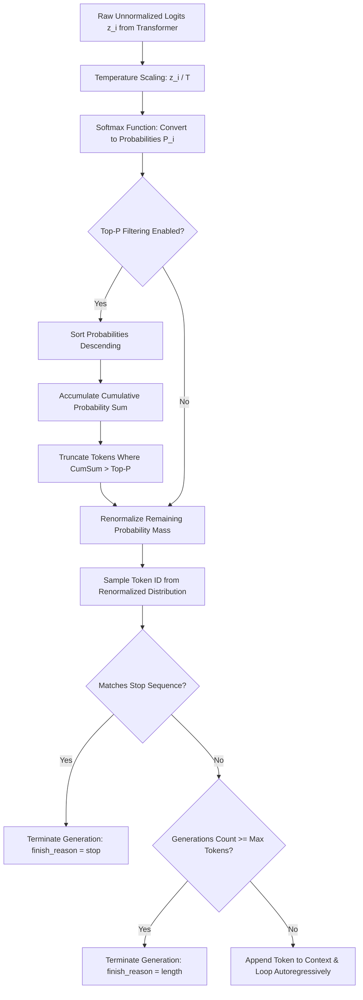

# Topic 4: Model Configuration

## 1. Overview

### What It Is
Model Configuration refers to the runtime hyperparameters and control parameters supplied alongside a prompt when making an inference call to a Large Language Model (LLM). While neural network weights remain fixed during post-training deployment, model configuration knobs—such as **Temperature**, **Top-P (Nucleus Sampling)**, **Max Tokens**, **Stop Sequences**, and **Seed**—dynamically shape the probability distribution of generated tokens, enforce structural boundaries, and govern output randomness.

### Why It Exists
Under the hood, an LLM is a probabilistic autoregressive token predictor. At each step of the generation loop, the model computes a vector of raw unnormalized scores (logits) across its entire vocabulary (often 32,000 to 128,000+ tokens). Without runtime parameters, the model would either default to pure deterministic greedy selection (always choosing the single highest-probability token) or raw unconstrained sampling. Model configuration exists to provide backend software engineers with precise control over the trade-off between **predictability vs. creativity**, **determinism vs. variability**, and **safety/cost limits vs. execution length**.

### Why Software Engineers Should Care
For backend engineers integrating AI into enterprise systems, default model configurations are rarely suitable for production:
* **Deterministic Operations (JSON/SQL/APIs):** Returning structured JSON, generating database queries, or parsing medical/financial data requires near-zero variance ($T \approx 0.0$). A high temperature can cause the model to generate invalid syntax or unparseable JSON keys.
* **Cost & Latency Control:** Uncapped model calls risk infinite loops or runaway generations. Setting strict `max_tokens` and `stop_sequences` prevents API budget exhaustion and guards against network timeouts.
* **Regression Testing & Debugging:** Automated CI/CD suites require reproducible test runs. Setting `seed` parameters enables deterministic sampling for regression testing.
* **Latency Optimization:** Generation tokens (output) are computationally expensive and priced 3x to 5x higher than prompt input tokens. Tuning generation parameters directly optimizes Time-to-First-Token (TTFT) and total request duration.

---

## 2. Core Concepts

### Temperature ($T$)
* **Definition:** A scalar parameter that scales raw logit values before applying the Softmax function, controlling the entropy (randomness) of the predicted token probability distribution.
* **Intuition:** Imagine a landscape of hills where hill heights represent token likelihoods. Lowering the temperature makes high hills taller and valleys deeper (forcing the model onto the highest peak), while raising the temperature flattens the landscape (making all paths roughly equal).
* **Practical Explanation:** 
  * $T 
ightarrow 0$ (e.g., $0.0$–$0.2$): Flattens low-probability options to near-zero and sharpens the top peak. Converts sampling into greedy decoding. Used for code generation, JSON extraction, and factual lookup.
  * $T = 0.7$–$0.8$: Balanced default for general conversation, summarization, and instruction-following.
  * $T \ge 1.0$: Flattens the distribution significantly, giving low-probability, unusual tokens a higher chance of being selected. Used for creative writing and brainstorming, but increases the risk of hallucination or grammatical degradation.
* **Common Misconception:** Higher temperature makes the model "smarter" or "know more facts." In reality, temperature does not alter model knowledge; it merely increases output variance across the existing logit distribution.

### Top-P (Nucleus Sampling)
* **Definition:** An adaptive sampling technique that restricts token selection to the smallest cumulative probability subset whose sum meets or exceeds the specified threshold $P \in (0, 1]$.
* **Intuition:** Instead of cutting off a fixed number of top words (like Top-$K$), Top-P dynamically expands or shrinks the candidate pool based on model confidence. If the model is very confident, the top 1 or 2 tokens might hold 90% of the probability mass. If the model is uncertain, 50 tokens might be needed to reach 90%.
* **Practical Explanation:**
  * Top-P = $0.90$: The engine sorts all vocabulary tokens by probability descending, accumulates tokens until their combined probability reaches $90\%$, discards the remaining $10\%$ of the long tail, and renormalizes the remaining pool for final sampling.
  * Top-P = $0.10$: Only the top candidates making up the upper 10% probability mass are considered, resulting in strict, highly focused outputs.
* **Common Misconception:** Engineers often assume Temperature and Top-P must both be tuned simultaneously. Industry standard practice (recommended by OpenAI and Anthropic) is to adjust **either** Temperature **or** Top-P, keeping the other at its default value ($1.0$).

### Max Tokens (`max_tokens` / `max_completion_tokens`)
* **Definition:** A hard quantitative ceiling on the maximum number of tokens the model is permitted to generate during a single inference completion pass.
* **Intuition:** An engine governor or execution timeout for output token generation.
* **Practical Explanation:** `max_tokens` limits generation length to protect infrastructure budgets and prevent infinite loops. If the model hits `max_tokens` before completing its thought or closing a JSON object, execution halts immediately with `finish_reason: "length"`.
* **Common Misconception:** Using `max_tokens` as a formatting tool to force a concise summary. Setting `max_tokens: 20` on a JSON request will not force the LLM to write a shorter JSON—it will simply truncate the JSON mid-string, rendering it unparseable. Concise responses must be requested in the system prompt.

### Stop Sequences (`stop`)
* **Definition:** A list of one or more string literal sequences that trigger immediate termination of model generation when encountered in the output stream.
* **Intuition:** A programmatic "kill word" or sentinel value monitored token-by-token during inference.
* **Practical Explanation:** When the detokenizer produces a token string matching any designated stop sequence (e.g., `["\n
", "User:", "```", "</span>"]`), the inference loop terminates, omits the stop string from the final response, and sets `finish_reason: "stop"`. Essential for multi-turn chat templates and agent tool-calling loops.
* **Common Misconception:** Expecting stop sequences to filter out sensitive content or toxicity. Stop sequences are structural termination markers, not semantic content filters.

### Seed (`seed`)
* **Definition:** An integer parameter passed to the server-side pseudorandom number generator (PRNG) to encourage deterministic sampling across identical API requests.
* **Intuition:** Setting the random seed in standard software libraries (e.g., `java.util.Random(12345)`).
* **Practical Explanation:** Supplying a fixed `seed` alongside identical parameters ($T$, Top-P, prompt) instructs backend inference cluster nodes to produce deterministic or near-deterministic outputs.
* **Common Misconception:** Expecting `seed` to guarantee 100% bitwise determinism across different hardware clusters or provider updates. Non-deterministic GPU floating-point operations (e.g., parallel atomic add operations in CUDA kernels) and multi-tenant load balancing can still introduce slight variance.

### Output Behavior & Creativity vs. Accuracy Trade-Off
* **Deterministic vs. Random:** Deterministic outputs ($T=0$, fixed `seed`) guarantee reproducible execution paths suitable for production pipelines. Random outputs ($T > 0.7$) introduce novelty and variation suitable for creative tasks.
* **Creativity vs. Accuracy Trade-off:** 

| Dimension | Low Temperature ($T < 0.2$) / Low Top-P | High Temperature ($T > 0.8$) / High Top-P |
| :--- | :--- | :--- |
| **Output Characteristics** | Focused, deterministic, conservative | Diverse, novel, creative, varied |
| **Primary Use Cases** | JSON extraction, SQL generation, math, RAG Q&A | Brainstorming, fiction, draft generation |
| **Hallucination Risk** | Minimized (adheres strictly to dominant logits) | Elevated (samples low-probability tokens) |
| **Format Compliance** | High (strict adherence to schemas) | Lower (risk of syntax degradation) |

---

## 3. Internal Workflow & Mathematical Pipeline

### Step-by-Step Sampling Lifecycle
When a prompt payload enters the LLM inference engine, the forward pass computes unnormalized logits for the next token across the vocabulary $V$. Model configuration parameters are applied sequentially in the Softmax and Sampling layer:



### Mathematical Softmax Scaling Formula
The raw logit vector $z = [z_1, z_2, \dots, z_V]$ output by the final linear layer is scaled by Temperature $T$ before being converted into probabilities via Softmax:

$$P(x_i) = rac{e^{z_i / T}}{\sum_{j=1}^{V} e^{z_j / T}}$$

* **When $T = 1.0$:** Standard Softmax distribution.
* **When $T 
ightarrow 0$:** The term $z_i / T$ approaches infinity for the maximum logit $z_{\max}$ faster than for any other $z_j$. The probability distribution converges to an indicator function (Kronecker delta):
  
$$\lim_{T 
ightarrow 0} P(x_i) = egin{cases} 1 & 	ext{if } z_i = \max(z) \ 0 & 	ext{otherwise} \end{cases}$$

### Top-P (Nucleus) Subset Selection
Given sorted probabilities $P(x_1) \ge P(x_2) \ge \dots \ge P(x_V)$, Nucleus sampling finds the smallest index $k$ such that:

$$\sum_{i=1}^{k} P(x_i) \ge P_{	ext{threshold}}$$

The candidate set $V^{(P)} = \{x_1, x_2, \dots, x_k\}$ is retained, while all tokens $x_{k+1} \dots x_V$ are assigned probability 0. The remaining mass is renormalized:

$$P'(x_i) = rac{P(x_i)}{\sum_{j=1}^{k} P(x_j)} \quad orall i \le k$$

---

## 4. Real-world Backend Perspective

### Where Configuration Appears in Production Systems
In enterprise backend architectures, model configuration is configured at three distinct layers:
1. **API Gateway / AI Router:** Centralized policies set hard limits for `max_tokens` and apply strict defaults based on route metadata (e.g., `/api/v1/extract-json` defaults to `temperature: 0.0`).
2. **Service Integration Layer (Spring Boot / Java):** Client wrappers map business requirements to configuration objects sent over HTTP to model endpoints (Azure OpenAI, Anthropic Bedrock, vLLM).
3. **Dynamic Prompt Templates:** Metadata headers allow runtime overrides for specific user roles or tenant configurations.

### Production Recommendations by Domain

| Workload Domain | Recommended Temperature | Top-P | Stop Sequences | Max Tokens |
| :--- | :--- | :--- | :--- | :--- |
| **JSON Extraction / Schema Validation** | `0.0` | `1.0` | `["}", "```"]` | Strictly sized to expected JSON payload |
| **SQL Query Generation** | `0.0` | `1.0` | `[";", "```"]` | `256`–`512` tokens |
| **RAG Document Q&A** | `0.1`–`0.3` | `0.9` | `["User:", "

Doc:"]` | `512`–`1024` tokens |
| **Agent Tool Calling** | `0.0` | `1.0` | `["</tool_call>", "
Observation:"]` | `1024` tokens |
| **Chat / Conversational Assistants** | `0.7` | `0.95` | `["
User:", "<|im_end|>"]` | `2048` tokens |
| **Creative Content Generation** | `0.8`–`1.0` | `1.0` | None | `4096` tokens |

---

## 5. Best Practices

### Recommended Guidelines
* **Tune Temperature XOR Top-P:** Alter Temperature or Top-P, but do not adjust both simultaneously. Combining low Temperature with low Top-P can collapse the sample space unexpectedly.
* **Treat `max_tokens` as a Safety Circuit Breaker:** Always set an explicit `max_tokens` on every outgoing API request. Failing to specify `max_tokens` leaves your application exposed to runaway generation costs if a model enters an repetitive loop.
* **Set Structural Stop Sequences for Parsers:** When expecting formatted responses (e.g., Markdown blocks, multi-turn dialogue, or SQL scripts), set explicit stop sequences to cut off trailing conversational filler (e.g., *"Here is your SQL query:"*).
* **Enable `seed` for CI/CD Automated Evals:** In automated regression suites, pass a fixed `seed` parameter to isolate prompt performance changes from random generation variance.

### Performance, Cost, & Security Considerations
* **Cost Efficiency:** Output tokens cost 3x to 5x more than input tokens across OpenAI and Anthropic APIs. Lowering `max_tokens` and setting tight stop sequences directly reduces operational billing.
* **Time-to-First-Token (TTFT) vs. Total Latency:** While generation parameters do not impact TTFT (which depends on prompt length and prefill execution), they directly control total generation latency ($T_{	ext{total}} = 	ext{TTFT} + 	ext{Output Tokens} 	imes 	ext{Inter-Token Latency}$).
* **Security & Prompt Injection:** Malicious inputs can attempt to bypass system prompt boundaries or override stop sequences. Always enforce `max_tokens` at the backend gateway level rather than trusting prompt-level length constraints.

---

## 6. Common Mistakes

| Incorrect Understanding | Correct Understanding |
| :--- | :--- |
| Temperature alters the model's factual knowledge base. | Temperature only scales logit probabilities; it does not add or alter factual knowledge in weights. |
| Setting `max_tokens: 50` makes the model summarize its answer in 50 tokens. | `max_tokens` cuts off generation at 50 tokens, often leaving sentences or JSON objects truncated mid-string. |
| You should always tune Temperature and Top-P together for fine-grained control. | Providers recommend tuning Temperature **or** Top-P, leaving the other at default (`1.0`) to avoid double-squeezing the probability distribution. |
| Setting `temperature: 0.0` guarantees 100% identical byte-for-byte outputs every time. | GPU floating-point non-determinism (CUDA atomic operations) and multi-node load balancing can still cause occasional token shifts even at $T=0.0$. |
| Stop sequences censor toxic or prohibited content from output. | Stop sequences are exact string match triggers that halt execution; they do not perform safety or content filtering. |
| Setting `seed` guarantees deterministic results across model version upgrades. | `seed` only operates within a specific model snapshot version; provider model updates or hardware changes break seed reproducibility. |
| Higher temperature makes the model output tokens faster. | Inference latency per token is governed by hardware matrix multiplication speeds; temperature does not alter per-token generation speed. |

---

## 7. Code Implementation & API Specifications

### Raw HTTP REST API Request Example (JSON Payload)

```http
POST /v1/chat/completions HTTP/1.1
Host: api.openai.com
Authorization: Bearer YOUR_API_KEY
Content-Type: application/json

{
  "model": "gpt-4o",
  "messages": [
    {
      "role": "system",
      "content": "You are a backend service that extracts customer IDs from text. Output ONLY raw JSON with key 'customer_id'."
    },
    {
      "role": "user",
      "content": "Account update for User CUST-99281-X in region US-East."
    }
  ],
  "temperature": 0.0,
  "max_tokens": 64,
  "stop": ["
", "```"],
  "seed": 42,
  "response_format": { "type": "json_object" }
}
```

### Spring Boot 3 WebClient Production Implementation

```java
package com.enterprise.ai.service;

import com.fasterxml.jackson.annotation.JsonProperty;
import org.springframework.beans.factory.annotation.Value;
import org.springframework.http.HttpHeaders;
import org.springframework.http.MediaType;
import org.springframework.stereotype.Service;
import org.springframework.web.reactive.function.client.WebClient;
import reactor.core.publisher.Mono;

import java.util.List;

@Service
public class ModelConfigurationService {

    private final WebClient webClient;

    public ModelConfigurationService(
            WebClient.Builder webClientBuilder,
            @Value("${ai.api.key}") String apiKey,
            @Value("${ai.api.url:https://api.openai.com}") String baseUrl) {
        
        this.webClient = webClientBuilder
                .baseUrl(baseUrl)
                .defaultHeader(HttpHeaders.AUTHORIZATION, "Bearer " + apiKey)
                .defaultHeader(HttpHeaders.CONTENT_TYPE, MediaType.APPLICATION_JSON_VALUE)
                .build();
    }

    public Mono<ChatCompletionResponse> executeConfiguredInference(
            String systemPrompt, 
            String userPrompt, 
            double temperature, 
            int maxTokens, 
            List<String> stopSequences) {

        ChatCompletionRequest requestPayload = new ChatCompletionRequest(
                "gpt-4o",
                List.of(
                        new Message("system", systemPrompt),
                        new Message("user", userPrompt)
                ),
                temperature,
                maxTokens,
                stopSequences,
                42L
        );

        return this.webClient.post()
                .uri("/v1/chat/completions")
                .bodyValue(requestPayload)
                .retrieve()
                .bodyToMono(ChatCompletionResponse.class);
    }

    // DTO Records
    public record Message(String role, String content) {}

    public record ChatCompletionRequest(
            String model,
            List<Message> messages,
            double temperature,
            @JsonProperty("max_tokens") int maxTokens,
            List<String> stop,
            Long seed
    ) {}

    public record Choice(Message message, @JsonProperty("finish_reason") String finishReason) {}
    public record Usage(@JsonProperty("prompt_tokens") int promptTokens, @JsonProperty("completion_tokens") int completionTokens) {}
    public record ChatCompletionResponse(List<Choice> choices, Usage usage) {}
}
```

---

## 8. Interview Questions

### Beginner
1. What is the difference between Temperature and Top-P in LLM sampling?
2. What happens to the generated output when Temperature is set to $0.0$?
3. How does setting `max_tokens` affect model execution and response parsing?
4. What is a stop sequence, and how is it used during the inference loop?
5. Why is it generally recommended to adjust Temperature OR Top-P, but not both at the same time?

### Intermediate
6. Mathematically explain how Temperature scaling modifies the Softmax probability distribution over raw logits.
7. Explain the step-by-step algorithm of Top-P (Nucleus) sampling and how it differs from Top-$K$ sampling.
8. How does setting `max_tokens` differ from specifying concise output constraints in the system prompt?
9. What causes non-determinism in LLM outputs even when Temperature is set to $0.0$ and a fixed `seed` is provided?
10. How do generation parameters affect Time-to-First-Token (TTFT) versus total request latency?

### Senior (Scenario-based)
11. **System Design Scenario:** You are building an enterprise microservice that generates SQL queries from natural language for a high-throughput financial application. How would you configure generation parameters, stop sequences, and validation logic to guarantee syntactic safety, zero hallucinated table names, and minimal latency?
12. **Incident Troubleshooting:** In production, your team notices that 5% of structured JSON responses from an LLM service are returning truncated, unparseable JSON payloads. The system prompt explicitly instructs the model to return valid JSON. What configuration parameter is likely causing this issue, how do you diagnose it using API response metadata, and what architectural fixes should be applied?
13. **Cost & FinOps Strategy:** An enterprise AI platform processes 10 million daily chat turns. Production telemetry reveals that conversational responses frequently contain trailing filler and repetitive pleasantries. How would you leverage stop sequences, `max_tokens`, and system prompt formatting to reduce output token consumption by 25% without degrading answer quality?
14. **CI/CD & Evals Architecture:** You are tasked with implementing an automated integration testing suite for an AI application using LLM-as-a-judge. How do you design the test harness leveraging `seed`, Temperature, and prompt versioning to ensure flaky tests are eliminated while still capturing real regression signals?
15. **Security & Guardrails:** A user-facing AI agent allows dynamic user configuration of sampling parameters via an API. A security audit discovers that attackers can pass custom stop sequences and inflated `max_tokens` values to exhaust server budgets and hijack agent dialog loops. How would you design an API Gateway parameter sanitization layer to mitigate these vulnerabilities?
