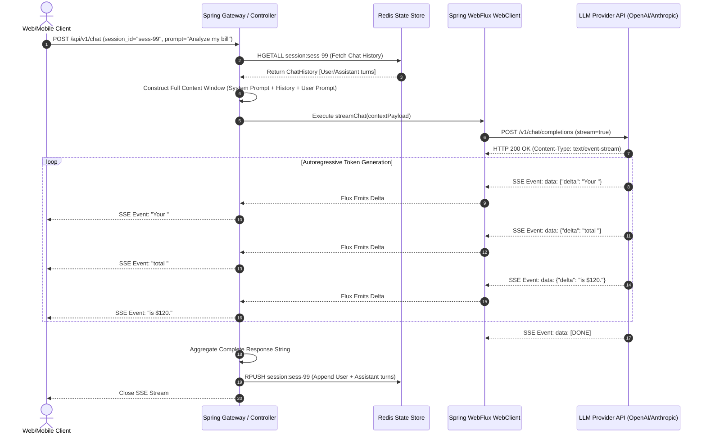
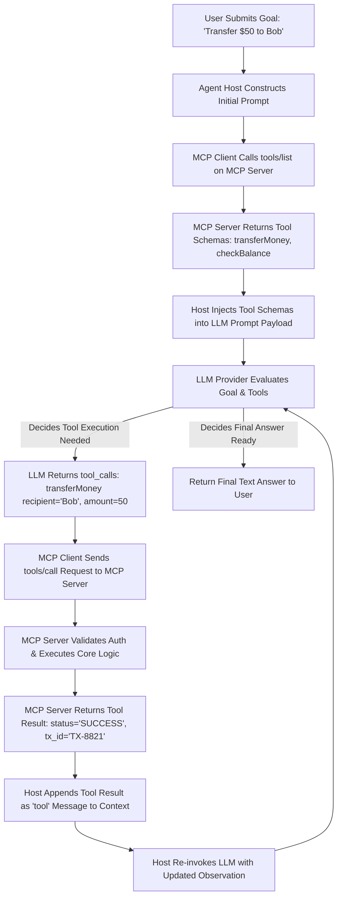

# Topic 6: AI Application Development

## 1. Overview

### What It Is
**AI Application Development** is the software engineering discipline of designing, building, and operating production-grade systems powered by Large Language Models (LLMs) [cite: 14, 30]. Rather than treating an LLM as a simple text generator or an informal chatbot, enterprise AI application development integrates non-deterministic model endpoints into deterministic backend architectures [cite: 22, 30]. It encompasses API integration patterns, real-time response streaming, distributed conversation state management, fault-tolerant retry strategies, autonomous AI agents, tool integration, and protocol standardization via the **Model Context Protocol (MCP)** [cite: 5, 14, 19, 31].

### Why It Exists
Integrating Large Language Models directly into enterprise software introduces fundamental architectural challenges that traditional HTTP services do not possess [cite: 22, 30]:
1. **Long-Tailed Latency Profiles**: LLM token generation is autoregressive and slow, taking anywhere from hundreds of milliseconds to tens of seconds to complete, rendering traditional synchronous blocking HTTP calls prone to socket timeouts and connection pool exhaustion [cite: 5, 30].
2. **Stateless Model APIs**: Managed LLM endpoints are completely stateless; every invocation requires the application to explicitly reconstruct and inject historical context without exceeding context window constraints or inflating token bills [cite: 3, 23, 31].
3. **Non-Deterministic Execution**: Models can hallucinate, fail schema constraints, or hit transient rate limits (HTTP 429), requiring sophisticated fallback, validation, and retry mechanisms [cite: 1, 20, 22].
4. **Integration Fragmentation**: Connecting LLMs to disparate internal databases, enterprise APIs, and local developer tools historically required bespoke, proprietary connectors for every model-tool pair [cite: 2, 19, 21].

Backend AI Application Development provides the architectural patterns, resilience primitives, and protocol standards needed to transform volatile LLM APIs into reliable, scalable software services [cite: 5, 20, 30].

### Why Software Engineers Should Care
For backend software engineers in the Java/Spring ecosystem, AI engineering is an extension of distributed systems design [cite: 30]. An LLM endpoint is essentially an untrusted, high-latency, probabilistic third-party microservice [cite: 22, 30]. Mastering backend integration allows engineers to:
- **Build High-Throughput Reactive Interfaces**: Leverage non-blocking I/O and Server-Sent Events (SSE) to stream live tokens to clients, reducing perceived Time-to-First-Token (TTFT) latency [cite: 5, 6].
- **Manage Stateful Memory at Scale**: Architect distributed conversation stores using Redis or DynamoDB to maintain stateless application instances while preserving multi-turn user context [cite: 31].
- **Ensure System Resilience**: Implement rate-limiting queues, circuit breakers, and capped exponential backoff with full jitter to gracefully withstand upstream provider outages and rate limit spikes [cite: 20, 44].
- **Orchestrate Autonomous Agents & MCP**: Implement ReAct decision loops and adopt the open Model Context Protocol (MCP) to securely connect LLMs to internal tools and enterprise data stores [cite: 19, 23, 43].

---

## 2. Core Concepts

### Backend Integration

#### Calling LLM APIs & SDK Abstractions
Modern enterprise applications interact with LLM providers (e.g., OpenAI, Anthropic, Azure OpenAI, Google Gemini) via stateless HTTP REST or gRPC APIs [cite: 21]. Higher-level framework abstractions like **Spring AI** and **LangChain4j** wrap these raw REST calls into idiomatic Java interfaces (such as `ChatModel`, `StreamingChatModel`, and `Prompt`) [cite: 30]. However, underlying these abstractions is standard HTTP JSON payload marshaling containing system messages, user prompts, temperature, and tool definitions [cite: 28, 30].

#### Streaming APIs (Server-Sent Events)
Because autoregressive token generation generates text sequentially, waiting for an entire output generation pass (which may take 10+ seconds) creates poor user experiences and risks connection timeouts [cite: 5, 30, 41]. 
- **Server-Sent Events (SSE)**: A lightweight, unidirectionally streaming HTTP standard (`text/event-stream`) where the server keeps an HTTP connection open and pushes individual generated text chunks (deltas) to the client in real time as `data: {...}` lines [cite: 5, 6].
- **Reactive Backends**: In Java/Spring Boot architectures, SSE streaming is implemented using non-blocking reactive frameworks (e.g., Spring WebFlux `WebClient` or `Flux<String>`), allowing a single thread to process thousands of concurrent token streams without thread-per-request blocking [cite: 5, 6, 30].

```
Client Application          Spring WebFlux Backend               Managed LLM API
      |                               |                                 |
      |--- 1. HTTP POST Request ----->|                                 |
      |                               |--- 2. POST /chat (stream=true)->|
      |                               |                                 |
      |<-- 3. HTTP 200 (event-stream)-|                                 |
      |<-- 4. SSE Chunk "Hello" ------|<-- 5. HTTP Chunk "Hello" -------|
      |<-- 6. SSE Chunk " World" -----|<-- 7. HTTP Chunk " World" ------|
      |<-- 8. SSE Chunk [DONE] -------|<-- 9. HTTP Chunk [DONE] --------|
```

#### Chat Sessions & Conversation Memory
Because LLM APIs are stateless, multi-turn conversational applications must pass the entire interaction history with every new request [cite: 23, 31]. To prevent token inflation and context window exhaustion, backends implement three core memory patterns [cite: 3, 31]:

1. **Sliding Window Memory**: Retains only the most recent $N$ interactions (e.g., last 10 messages) or the last $K$ tokens, dropping older turns [cite: 31]. 
   - *Trade-off*: Fast and cheap, but completely forgets instructions or context provided at the start of long conversations [cite: 3, 31].
2. **Summary Memory**: Uses a lightweight background LLM job to summarize older conversational turns into a concise text block, appending this running summary to the system prompt alongside the most recent $N$ raw turns [cite: 31].
   - *Trade-off*: Preserves long-term context with minimal token consumption, but incurs additional background LLM processing latency and API costs [cite: 3, 31].
3. **State Store Pattern**: Application instances remain entirely stateless [cite: 31]. Conversational traces are persisted in a fast distributed cache (e.g., Redis) keyed by a unique `session_id` [cite: 31]. On each incoming HTTP request, the backend fetches the session history from Redis, constructs the prompt, calls the LLM, appends the new assistant response to Redis, and returns the result [cite: 31].

#### Error Handling, Retries & Rate Limiting
Production integrations must treat LLM APIs as volatile external dependencies subject to strict provider quotas (RPM: Requests Per Minute, TPM: Tokens Per Minute) and transient 5xx server errors [cite: 20, 21].
- **Capped Exponential Backoff with Full Jitter**: When encountering HTTP 429 (Rate Limit Exceeded) or HTTP 503 (Service Unavailable), retries must use exponential delay ($t_{retry} = \min(t_{max}, t_{base} 	imes 2^{attempt})$) randomized with full uniform jitter ($t_{actual} = 	ext{random}(0, t_{retry})$) [cite: 20]. Jitter prevents "thundering herd" problems where thousands of concurrent threads retry simultaneously and re-trigger provider rate limits [cite: 20].
- **Concurrency Queues & Rate Limiters**: Implementing local or distributed token bucket algorithms (e.g., Resilience4j or Redis RateLimiter) at the API gateway layer to smooth out traffic spikes before requests reach the provider API [cite: 20].

---

### AI Agents & Model Context Protocol (MCP)

#### What is an AI Agent?
An **AI Agent** is an autonomous software system that uses a Large Language Model as its central decision-making engine [cite: 2, 43]. Unlike a simple single-turn prompt pipeline, an agent operates in a continuous control loop: it evaluates a high-level user goal, formulates a multi-step plan, dynamically selects and invokes external tools to gather context or execute actions, observes the outcomes, and iteratively adapts its strategy until the goal is achieved [cite: 43].

#### Agent Workflow (The ReAct Pattern)
The dominant architectural pattern for AI agents is **ReAct** (Reasoning + Acting) [cite: 43]:

```
+-----------------------------------------------------------------------+
| 1. REASON: LLM analyzes user goal and prior observations.              |
|    Output: "I need to check the inventory status for SKU-1029."       |
+-----------------------------------------------------------------------+
                                   |
                                   v
+-----------------------------------------------------------------------+
| 2. ACT: LLM selects a tool and outputs structured JSON arguments.      |
|    Output: tool_calls: checkInventory(sku="SKU-1029")                  |
+-----------------------------------------------------------------------+
                                   |
                                   v
+-----------------------------------------------------------------------+
| 3. OBSERVE: Application executes tool and returns output to LLM.       |
|    Input: Tool Result: {"sku": "SKU-1029", "stock": 0, "next_ship": "Mon"}|
+-----------------------------------------------------------------------+
                                   |
                                   v
+-----------------------------------------------------------------------+
| 4. LOOP / FINALIZE: LLM evaluates observation and generates answer.   |
|    Output: "SKU-1029 is out of stock. Next shipment arrives Monday."   |
+-----------------------------------------------------------------------+
```

#### Tool Calling (Function Calling)
Tool calling is the programmatic bridge that allows LLMs to interact with external code [cite: 2, 19, 43].
- **Schema Registration**: The application passes a list of available tools to the LLM API, complete with JSON Schemas detailing function parameters and natural language descriptions [cite: 19, 29].
- **Execution Boundary**: The LLM *never* executes code directly [cite: 19]. It outputs a structured JSON object specifying which function to run and with what arguments [cite: 19]. The backend application intercepts this payload, validates the parameters against the schema, executes the local Java/Database function within an authorized security boundary, and returns the result back to the LLM [cite: 19, 23, 45].

#### Model Context Protocol (MCP) Overview
The **Model Context Protocol (MCP)** is an open, standardized protocol created by Anthropic in late 2024 and adopted across the industry (OpenAI, Google, Microsoft, Linux Foundation) to solve the $M 	imes N$ integration problem between LLM applications (hosts) and external data sources or tools [cite: 2, 11, 13, 21].

```
+-----------------------------------------------------------------------+
| MCP HOST APPLICATION (e.g., Spring Boot AI Service, IDE, Chat App)    |
|  +-----------------------------------------------------------------+  |
|  | MCP CLIENT (Internal protocol connector)                        |  |
|  +-----------------------------------------------------------------+  |
+----------------------------------|------------------------------------+
                                   | JSON-RPC 2.0 (STDIO / SSE)
                                   v
+-----------------------------------------------------------------------+
| MCP SERVER (Independent Microservice / Executable)                   |
| Exposes standardized primitives to the host:                          |
| - TOOLS: Executable functions (e.g., executeSQL, searchSlack)         |
| - RESOURCES: Read-only context (e.g., db://schema, file:///logs.txt)   |
| - PROMPTS: Pre-built prompt templates (e.g., debug-code-template)     |
+-----------------------------------------------------------------------+
```

##### Core MCP Architecture & Components
1. **MCP Host**: The coordinating application environment containing the LLM [cite: 2, 19, 22].
2. **MCP Client**: An internal connector inside the host that maintains a dedicated 1:1 connection with an MCP server, translating model tool requests into standard MCP messages [cite: 2, 19, 22].
3. **MCP Server**: A lightweight, independent service or process exposing tools, resources, and prompts [cite: 19, 22].

##### MCP Transports
MCP uses **JSON-RPC 2.0** as its base messaging specification over two primary transport protocols [cite: 8, 22, 26]:
- **STDIO (Standard Input/Output)**: Used for local sub-process communication (e.g., a local desktop application spawning a CLI tool) [cite: 22, 26]. Extremely fast and secure [cite: 26].
- **Streamable HTTP / SSE (Server-Sent Events)**: Used for remote network microservices [cite: 5, 22, 26]. Enables decoupled, cloud-hosted MCP servers to serve multiple host applications securely [cite: 22].

##### MCP Core Primitives
- **Tools**: Executable functions exposed by the server (`tools/list`, `tools/call`) [cite: 19, 23].
- **Resources**: Read-only contextual data sources exposed via URI schemes (`resources/list`, `resources/read`) [cite: 19, 22].
- **Prompts**: Standardized, reusable prompt templates managed server-side (`prompts/list`, `prompts/get`) [cite: 19, 22].
- **Elicitation**: A client-side capability allowing MCP servers to request additional user input or confirmation mid-execution through Multi Round-Trip Requests [cite: 23, 24].

---

### Engineering Concerns & Observability

#### Cost Optimization (FinOps)
Because LLM APIs bill dynamically per input and output token, unmonitored agent loops and unbounded contexts create massive financial risk [cite: 3, 15, 26]:
- **Token Budgeting**: Enforcing hard `max_tokens` ceilings on every API request to prevent run-away generations [cite: 3, 22].
- **Model Routing**: Using gateway routers (e.g., RouteLLM, Bifrost) to direct simple classification or parsing tasks to cheap utility models (e.g., Claude Haiku, GPT-4o mini) while reserving expensive frontier models (Claude Opus, GPT-4o) for complex multi-step reasoning [cite: 21, 28].
- **Multi-Tier Caching**: Combining **Prompt Prefix Caching** (caching static system prompts at the provider level for 50-90% discounts) with **Semantic Caching** (using vector similarity in Redis/GPTCache to intercept repetitive queries without touching the LLM) [cite: 7, 12, 13, 14].

```
Incoming Request
      |
      v
+-------------------+      Cache Hit (Sub-10ms, $0)
| Semantic Cache    |----------------------------------> Return Cached Output
+-------------------+
      | Cache Miss
      v
+-------------------+      Provider Prefix Match
| Managed LLM API   |----------------------------------> 90% Discounted Prefill
| (Prompt Caching)  |
+-------------------+
```

#### Latency & Timeouts
LLM latency consists of two distinct components [cite: 12, 16]:
1. **Time-to-First-Token (TTFT)**: The latency required for the provider to process input tokens (prefill phase) and output the very first token [cite: 12, 16].
2. **Inter-Token Latency (TBT)**: The time between generating subsequent tokens during the autoregressive decode phase [cite: 16].

*Backend Timeout Strategy*: Standard HTTP read timeouts must be decoupled from connection timeouts [cite: 5, 30]. When streaming via SSE, configure a short connection timeout (e.g., 5 seconds) but a long read timeout (e.g., 60 seconds), resetting the read timer on every received SSE token chunk [cite: 5, 6].

#### Logging, Tracing & Observability
Traditional logging (capturing HTTP status codes and CPU metrics) is completely insufficient for non-deterministic AI pipelines [cite: 27, 36, 37]. 
- **OpenTelemetry (OTel) Tracing**: Modern AI backends emit structured OpenTelemetry spans for every stage of request processing [cite: 27, 36]. A single user trace tracks [cite: 27, 36, 37]:
  1. Prompt construction and context retrieval duration [cite: 23, 34].
  2. Exact input and output token counts [cite: 3, 37].
  3. Prompt cache hit/miss status [cite: 12, 37].
  4. Individual agent tool call invocations and parameters [cite: 19, 27].
  5. LLM judge evaluation metrics (e.g., TruLens groundedness or RAGAS faithfulness scores) attached directly to execution spans [cite: 27, 31, 36].

---

## 3. Internal Workflow & Architecture

### End-to-End Reactive Streaming & State Management Workflow

The following Mermaid sequence diagram illustrates a production-grade Java/Spring Boot backend handling a multi-turn chat request with reactive SSE token streaming and Redis conversation state persistence:



---

### AI Agent ReAct & MCP Tool Execution Workflow

The following flowchart illustrates the decision loop of an AI agent discovering and executing tools via an MCP Server:



---

## 4. Real-World Backend Perspective

### Production Spring Boot Implementation

The following production-grade Java class demonstrates how a senior backend engineer builds a resilient, reactive AI orchestration service in **Spring Boot 3** using Spring WebFlux `WebClient`, **Resilience4j** retry logic with exponential backoff and full jitter, and **Reactive Redis** state management.

```java
package com.enterprise.ai.service;

import com.fasterxml.jackson.databind.ObjectMapper;
import io.github.resilience4j.reactor.retry.RetryOperator;
import io.github.resilience4j.retry.Retry;
import io.github.resilience4j.retry.RetryConfig;
import org.slf4j.Logger;
import org.slf4j.LoggerFactory;
import org.springframework.data.redis.core.ReactiveRedisTemplate;
import org.springframework.http.MediaType;
import org.springframework.stereotype.Service;
import org.springframework.web.reactive.function.client.WebClient;
import reactor.core.publisher.Flux;
import reactor.core.publisher.Mono;

import java.time.Duration;
import java.util.*;

@Service
public class ResilientLlmOrchestratorService {

    private static final Logger log = LoggerFactory.getLogger(ResilientLlmOrchestratorService.class);
    private static final String REDIS_CHAT_KEY_PREFIX = "chat:session:";

    private final WebClient llmWebClient;
    private final ReactiveRedisTemplate<String, String> redisTemplate;
    private final ObjectMapper objectMapper;
    private final Retry resilienceRetry;

    public ResilientLlmOrchestratorService(WebClient.Builder webClientBuilder,
                                           ReactiveRedisTemplate<String, String> redisTemplate,
                                           ObjectMapper objectMapper) {
        this.llmWebClient = webClientBuilder
                .baseUrl("https://api.openai.com/v1")
                .defaultHeader("Authorization", "Bearer " + System.getenv("OPENAI_API_KEY"))
                .build();
        this.redisTemplate = redisTemplate;
        this.objectMapper = objectMapper;

        // Resilience4j Retry: Capped Exponential Backoff with Full Jitter for HTTP 429 / 5xx
        RetryConfig retryConfig = RetryConfig.custom()
                .maxAttempts(4)
                .waitDuration(Duration.ofMillis(500))
                .intervalFunction(io.github.resilience4j.core.IntervalFunction
                        .ofExponentialBackoff(500, 2.0, 5000)) // Max 5s delay
                .retryExceptions(LlmTransientException.class)
                .build();
        this.resilienceRetry = Retry.of("llmApiRetry", retryConfig);
    }

    /**
     * Streams LLM response tokens via SSE while maintaining state in Redis.
     */
    public Flux<String> streamChatResponse(String sessionId, String userPrompt) {
        String redisKey = REDIS_CHAT_KEY_PREFIX + sessionId;

        // 1. Fetch Session History from Redis -> Construct Context -> Stream -> Append State
        return redisTemplate.opsForList().range(redisKey, 0, -1)
                .collectList()
                .flatMapMany(history -> {
                    List<Map<String, String>> messages = buildContextPayload(history, userPrompt);
                    Map<String, Object> requestBody = Map.of(
                            "model", "gpt-4o",
                            "messages", messages,
                            "stream", true,
                            "temperature", 0.2,
                            "max_tokens", 1000
                    );

                    StringBuilder completeAssistantResponse = new StringBuilder();

                    return llmWebClient.post()
                            .uri("/chat/completions")
                            .contentType(MediaType.APPLICATION_JSON)
                            .bodyValue(requestBody)
                            .accept(MediaType.TEXT_EVENT_STREAM)
                            .retrieve()
                            .onStatus(status -> status.value() == 429 || status.is5xxServerError(),
                                    response -> Mono.error(new LlmTransientException("Transient LLM API Error: " + response.statusCode())))
                            .bodyToFlux(String.class)
                            .transformDeferred(RetryOperator.of(resilienceRetry)) // Apply Resilient Retry
                            .filter(chunk -> !chunk.equals("[DONE]"))
                            .map(chunk -> parseTokenDelta(chunk))
                            .doOnNext(completeAssistantResponse::append)
                            .doOnComplete(() -> {
                                // 2. Async Persist Turn to Redis upon successful stream completion
                                persistTurnToRedis(redisKey, userPrompt, completeAssistantResponse.toString()).subscribe();
                            });
                });
    }

    private List<Map<String, String>> buildContextPayload(List<String> rawHistory, String userPrompt) {
        List<Map<String, String>> messages = new ArrayList<>();
        // System Message
        messages.add(Map.of("role", "system", "content", "You are a helpful Spring Boot Assistant. Output concise answers."));
        
        // Deserialize historical Redis turns
        for (String turn : rawHistory) {
            try {
                Map<String, String> msg = objectMapper.readValue(turn, Map.class);
                messages.add(msg);
            } catch (Exception e) {
                log.error("Failed to deserialize chat turn", e);
            }
        }
        // Current User Message
        messages.add(Map.of("role", "user", "content", userPrompt));
        return messages;
    }

    private String parseTokenDelta(String rawJson) {
        try {
            Map<String, Object> map = objectMapper.readValue(rawJson, Map.class);
            List choices = (List) map.get("choices");
            if (choices != null && !choices.isEmpty()) {
                Map choice = (Map) choices.get(0);
                Map delta = (Map) choice.get("delta");
                if (delta != null && delta.containsKey("content")) {
                    return (String) delta.get("content");
                }
            }
        } catch (Exception e) {
            // Ignore parse errors on empty keep-alive pings
        }
        return "";
    }

    private Mono<Void> persistTurnToRedis(String redisKey, String userPrompt, String assistantResponse) {
        try {
            String userJson = objectMapper.writeValueAsString(Map.of("role", "user", "content", userPrompt));
            String assistantJson = objectMapper.writeValueAsString(Map.of("role", "assistant", "content", assistantResponse));
            return redisTemplate.opsForList().rightPushAll(redisKey, userJson, assistantJson)
                    .then(redisTemplate.expire(redisKey, Duration.ofDays(7))) // 7-Day TTL
                    .then();
        } catch (Exception e) {
            log.error("Failed to persist turn to Redis", e);
            return Mono.empty();
        }
    }

    public static class LlmTransientException extends RuntimeException {
        public LlmTransientException(String message) { super(message); }
    }
}
```

---

## 5. Best Practices

### Architectural Trade-offs

| Architectural Decision | Option A | Option B | Production Recommendation |
| :--- | :--- | :--- | :--- |
| **API Response Mode** | **Synchronous Blocking HTTP**<br>Waits for full generation before returning. | **Server-Sent Events (SSE)**<br>Streams token deltas continuously. | **Use SSE Streaming** for user-facing applications to reduce perceived latency [cite: 5, 6]. Reserve blocking calls for offline batch processing [cite: 27, 30]. |
| **State Management** | **In-Memory Sticky Sessions**<br>Stores chat history in application heap memory. | **Distributed Redis Cache**<br>Stores chat history in centralized Redis keyed by `session_id`. | **Use Distributed Redis** [cite: 31]. Sticky sessions break horizontal scaling and cause state loss during container restarts [cite: 31]. |
| **Tool Integration** | **Bespoke Function Calling**<br>Custom HTTP integrations per tool. | **Model Context Protocol (MCP)**<br>Standardized JSON-RPC protocol. | **Adopt MCP** for enterprise ecosystems to decouple host applications from tool implementations [cite: 2, 19, 21]. |

### Security & Operational Guidelines

1. **Enforce Strict Tool Execution Boundaries**: Never allow an AI agent to execute un-sandboxed code, raw SQL queries, or destructive state changes (e.g., deleting a database record) without explicit **Human-in-the-Loop (HITL)** authorization or strict parameter validation [cite: 19, 23, 45].
2. **Defend Against Indirect Prompt Injection**: When tools fetch context from untrusted external sources (e.g., reading user emails, scraping web pages, parsing PDFs), isolate the retrieved context inside XML delimiters (`<external_content>`) and instruct the LLM to treat it strictly as data, not as executable instructions [cite: 13, 38].
3. **Decouple HTTP Read Timeouts for Streaming**: Set tight connection timeouts (e.g., 3-5s) but extend read timeouts (e.g., 60s) for SSE connections, configuring the client to reset the read timer on every received token chunk [cite: 5, 6, 30].
4. **Cap Context Growth**: Always implement sliding window pruning or automatic summarization on Redis conversation keys to prevent long sessions from exceeding model context limits and causing billing spikes [cite: 3, 22, 31].

---

## 6. Common Mistakes

| Incorrect Understanding | Correct Understanding |
| :--- | :--- |
| **"LLM APIs maintain user chat state automatically on the provider's servers."** | Managed LLM APIs are completely stateless [cite: 23, 31]. The backend application must explicitly pass the full conversation history with every single request [cite: 23, 31]. |
| **"When an AI agent executes a tool call, the model directly runs code inside its neural network."** | Models never execute code [cite: 19]. The model outputs a structured JSON description of a function call; the host application executes the code within its own environment and returns the result to the model [cite: 19, 23]. |
| **"Standard HTTP 30-second read timeouts are sufficient for LLM API calls."** | Long generation runs or severe provider multi-tenant congestion can delay response tokens past 30 seconds [cite: 5, 21, 30]. Streaming APIs must reset read timers on every token delta rather than using static timeouts [cite: 5, 6]. |
| **"Retrying failed LLM API calls immediately with a simple loop is fine."** | Immediate retries trigger "thundering herd" bottlenecks during provider rate-limit spikes (HTTP 429) [cite: 20]. Retries MUST use exponential backoff with full random jitter [cite: 20]. |
| **"Model Context Protocol (MCP) is a replacement for Retrieval-Augmented Generation (RAG)."** | RAG is a pattern for passive context retrieval [cite: 33, 34]; MCP is a standardized two-way interaction protocol enabling hosts to access tools, read resources, and execute actions across disparate servers [cite: 2, 19, 277]. |
| **"Prompt caching means the LLM never gets invoked for similar user questions."** | Prompt Prefix Caching caches static prompt prefixes at the provider level to reduce prefill cost [cite: 12, 14, 205]. Returning instantaneous answers for similar questions without calling the LLM requires **Semantic Caching** [cite: 13, 17, 205]. |
| **"Storing chat history in JVM static memory maps works well for production chatbots."** | In-memory chat storage makes backend instances stateful, breaking horizontal scaling, auto-scaling, and rolling deployments [cite: 31]. Chat state must live in a distributed store like Redis [cite: 31]. |
| **"AI Agents can be safely deployed with full database admin write privileges."** | Autonomous agents are susceptible to prompt injection and decision errors [cite: 22, 38]. Tool execution permissions must follow the Principle of Least Privilege and require human approval for destructive operations [cite: 23, 45]. |

---

## 7. Interview Questions

### Beginner

#### 1. Why are Large Language Model APIs designed to be stateless, and how do backend applications handle multi-turn conversations?
#### 2. What is Server-Sent Events (SSE), and why is it preferred over standard blocking HTTP JSON calls for LLM integration?
#### 3. Explain the difference between System Prompts, User Prompts, and Assistant Messages in a Chat Completion API payload.
#### 4. What is Tool Calling (Function Calling), and which component actually executes the function code when a tool call is generated?
#### 5. How does a Sliding Window memory strategy differ from a Summary Memory strategy in managing chat history?

---

### Intermediate

#### 6. Walk through the step-by-step execution lifecycle of an AI Agent operating under the ReAct (Reasoning + Acting) pattern.
#### 7. What is the Model Context Protocol (MCP)? Explain the roles of the MCP Host, MCP Client, and MCP Server.
#### 8. How does Capped Exponential Backoff with Full Jitter protect backend services when handling HTTP 429 (Rate Limit Exceeded) errors from LLM providers?
#### 9. Compare Prompt Prefix Caching with Semantic Caching in terms of where they operate, what they store, and their financial impact.
#### 10. How would you design a distributed, stateless Spring Boot microservice architecture that manages chat sessions for 100,000 concurrent users using Redis?

---

### Senior (Scenario-Based)

#### 11. You are architecting a mission-critical financial assistant agent that can execute stock trades and check account balances via internal microservices. How do you design the tool calling security boundaries, authorization checks, and execution safety rules to prevent unauthorized state-changing operations triggered by prompt injection?
#### 12. Your mobile app uses an LLM backend that experiences severe latency spikes during peak hours, causing HTTP client read timeouts and dropped connections. How do you re-architect the backend using Spring WebFlux, non-blocking SSE streaming, and dynamic read timeout resets to resolve latency issues and maintain high throughput?
#### 13. An enterprise with 50 internal development teams is building custom AI tools for Slack, internal databases, and Jira. Every team is writing custom, proprietary wrapper code to connect these tools to different LLM providers, causing massive code duplication and security risks. How do you leverage the Model Context Protocol (MCP) to standardize this architecture across the organization?
#### 14. Your production AI pipeline is experiencing skyrocketing API bills due to massive multi-turn conversation logs and tool definitions being re-sent on every request. Walk through a FinOps engineering strategy involving token budgeting, prompt structure reorganization for prefix caching, semantic caching, and model routing to cut costs by 70% without sacrificing response quality.
#### 15. Describe how you would set up full-stack observability for an autonomous multi-agent system using OpenTelemetry (OTel). What specific spans, metrics, and trace attributes would you capture to diagnose an agent getting stuck in an infinite tool-execution loop?
